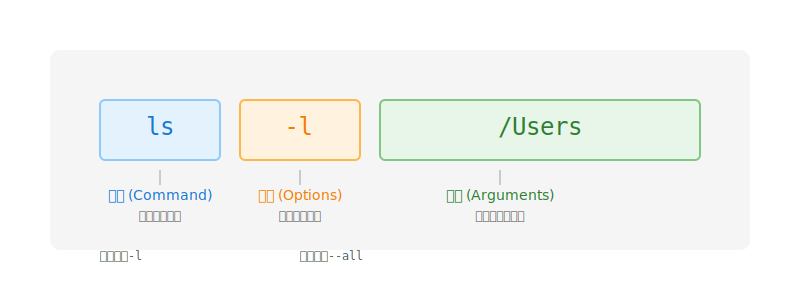
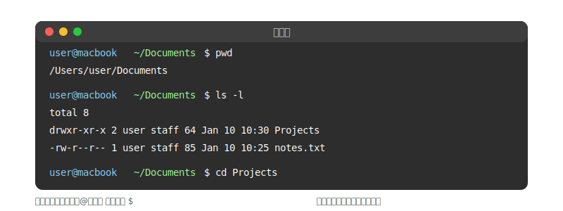
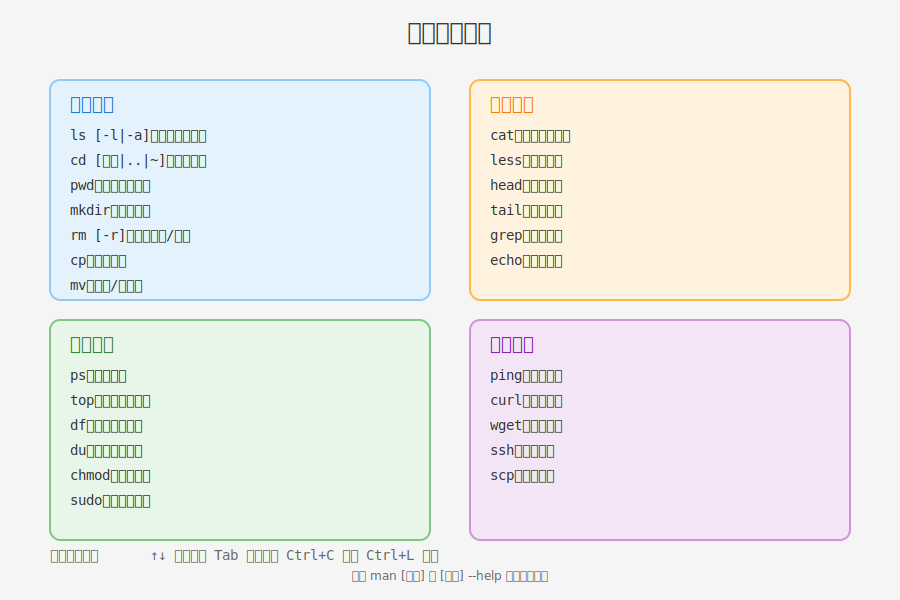

# 1.1 認識命令行

你有想過電腦是如何理解我們的指令的嗎？在現代電腦發展之前，人們是如何跟電腦溝通的？雖然現在我們習慣了點擊、拖曳等圖形介面操作，但其實在這些漂亮的按鈕背後，還存在著一個更原始、更強大的溝通方式：命令行（Command Line）。

它就像是一個可以直接對電腦下達指令的魔法介面，也是程式開發者最重要的工具之一。


## 什麼是終端機（Terminal）？


終端機就像是你和電腦對話的視窗。在 Mac 上，我們使用內建的「終端機」應用程式：

- 打開方式：應用程式 > 工具程式 > 終端機
- 快捷鍵：Command + 空格，輸入 "Terminal"


## 什麼是 Shell？

Shell 是在終端機中實際解釋和執行你輸入命令的程式。它就像是一個翻譯官，負責將你的命令翻譯成電腦能理解的語言：


- 最常見的 Shell 是 Bash 和 Zsh
- macOS 預設使用 Zsh
- 你可以輸入 `echo $SHELL` 來查看目前使用的 Shell

## 如何獲取命令的幫助？

當你不確定某個命令怎麼用時，有兩種方法可以查看說明：

1. `man` 命令（manual）：
```bash
man ls    # 查看 ls 命令的完整說明
```

2. `--help` 參數：
```bash
wget --help    # 查看 wget 命令的簡要說明
```

## 基本命令格式

每個命令都有其特定的格式，就像是一個完整的句子需要主詞、謂詞、受詞一樣。讓我們來看看命令的基本組成部分：



命令的基本格式如下：

```bash
command [options] [arguments]
```

例如：
```bash
ls -l /Users    # command: ls, option: -l, argument: /Users
```

### 命令組成部分說明：

1. command：要執行的指令
2. options：可選的參數，用來修改命令的行為
   - 短選項：單個字母，前面加一個減號（如：-l）
   - 長選項：完整單字，前面加兩個減號（如：--all）
3. arguments：命令的操作對象


## 命令執行示例

當你在終端機中輸入命令時，會看到類似下面的畫面。這裡展示了幾個基本命令的執行過程和結果：



在上面的例子中：
1. 使用 `pwd` 查看當前位置
2. 使用 `ls -l` 列出目錄內容
3. 使用 `cd` 切換到其他目錄

注意提示符的格式：
- 藍色部分：使用者名稱和主機名
- 綠色部分：當前所在目錄
- 白色部分：實際的命令和輸出結果

## 常用命令一覽

以下是開發者最常用的命令，我們將它們分類整理如下：



## 實用小技巧

1. 上下方向鍵：瀏覽之前輸入過的命令
2. Tab 鍵：自動補全命令或文件名
3. Ctrl + C：中斷當前執行的命令
4. Ctrl + L：清除螢幕

## 練習建議

1. 打開終端機，熟悉介面
2. 使用 `man` 和 `--help` 查看不同命令的說明
3. 練習使用方向鍵和 Tab 鍵
4. 試試這些基本命令：
   - `pwd`：顯示目前所在位置
   - `clear`：清除螢幕
   - `echo`：顯示一段文字

## 常見問題

Q：為什麼需要學習命令行？
A：命令行提供了更高的效率和更多的控制能力，是程式開發中不可或缺的工具。

Q：記不住這麼多命令怎麼辦？
A：剛開始不需要記住所有命令，先掌握基礎的幾個，遇到不會的多查說明文件即可。

Q：輸入錯誤的命令會怎樣？
A：不用擔心，系統會提示「命令找不到」或顯示錯誤信息，不會造成損害。

## 下一步

- 練習使用基本命令
- 漸漸熟悉命令行界面
- 建立自己的命令筆記 