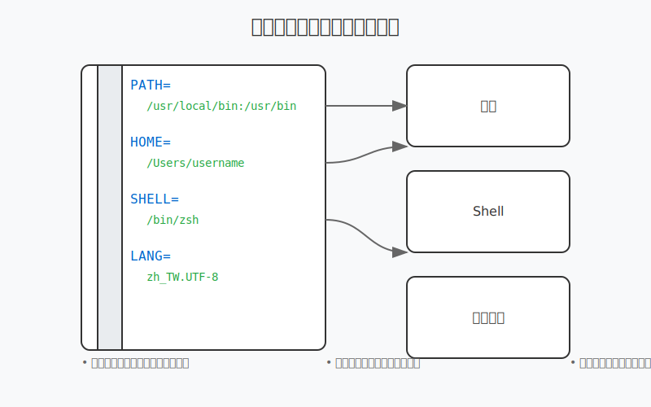

# 1.3 環境變量入門

環境變量就像是電腦的「設定檔」，它們儲存了系統和程式需要的重要資訊。理解環境變量對於程式開發非常重要。



## 什麼是環境變量？

想像環境變量就像是一個記事本，記錄著：
- 程式可以在哪裡找到其他程式（PATH）
- 你的個人資料夾在哪裡（HOME）
- 使用什麼語言（LANG）
- 等等...

## 查看環境變量

### 1. 查看所有環境變量

```bash
env           # 顯示所有環境變量
printenv      # 另一種顯示所有環境變量的方法
```

### 2. 查看特定環境變量

```bash
echo $PATH    # 查看 PATH 變量
echo $HOME    # 查看個人目錄位置
echo $SHELL   # 查看目前使用的 Shell
```

## 重要的環境變量

| 變量名 | 用途 | 範例值 |
|--------|------|--------|
| PATH | 系統搜尋程式的路徑 | /usr/local/bin:/usr/bin:/bin |
| HOME | 使用者的個人目錄 | /Users/username |
| SHELL | 目前使用的 Shell | /bin/zsh |
| LANG | 系統語言和地區設定 | en_US.UTF-8 |
| USER | 目前的使用者名稱 | username |

## 設定環境變量

### 1. 臨時設定（只在目前的終端機視窗有效）

```bash
export NAME="value"               # 設定新的環境變量
export PATH=$PATH:/new/path      # 新增路徑到 PATH
```

### 2. 永久設定

根據你使用的 Shell，編輯對應的設定檔：

- Zsh（Mac 預設）：`~/.zshrc`
- Bash：`~/.bash_profile` 或 `~/.bashrc`

```bash
# 編輯設定檔
code ~/.zshrc

# 加入以下內容
export NAME="value"
export PATH=$PATH:/new/path

# 重新載入設定
source ~/.zshrc
```

## PATH 變量詳解

PATH 是最重要的環境變量之一，它告訴系統去哪裡找執行檔。

### PATH 的結構
```bash
/usr/local/bin:/usr/bin:/bin
# 使用冒號分隔的路徑清單
# 系統會依序在這些目錄中尋找命令
```

### 修改 PATH 的常見操作

```bash
# 在 PATH 開頭加入新路徑
export PATH="/new/path:$PATH"

# 在 PATH 結尾加入新路徑
export PATH="$PATH:/new/path"
```

## 實用技巧

1. 使用 `echo` 確認變量設定：
```bash
export TEST="Hello"
echo $TEST    # 應該顯示 Hello
```

2. 使用大括號明確指定變量名：
```bash
echo ${PATH}  # 與 $PATH 相同，但更明確
```

3. 使用引號處理包含空格的值：
```bash
export NAME="John Doe"
```

## 常見問題

Q：為什麼我設定的環境變量在新開的終端機視窗消失了？
A：因為你使用 `export` 只是臨時設定。要永久保存，需要寫入 Shell 的設定檔。

Q：PATH 中的順序重要嗎？
A：是的，系統會依照 PATH 中的順序搜尋命令。排在前面的路徑優先級較高。

Q：如何檢查某個路徑是否在 PATH 中？
A：使用 `echo $PATH | grep "/要搜尋的路徑"`

## 練習建議

1. 查看並理解重要的環境變量：
```bash
echo $PATH
echo $HOME
echo $SHELL
```

2. 嘗試設定自己的環境變量：
```bash
export MYVAR="test"
echo $MYVAR
```

3. 修改 PATH 變量：
```bash
export PATH=$PATH:~/bin
```

#TODO

寫一段我們會把 openai key 加入 .zshrc

## 下一步

- 了解更多重要的環境變量
- 學習如何在專案中使用環境變量
- 研究不同 Shell 的環境變量設定方式 