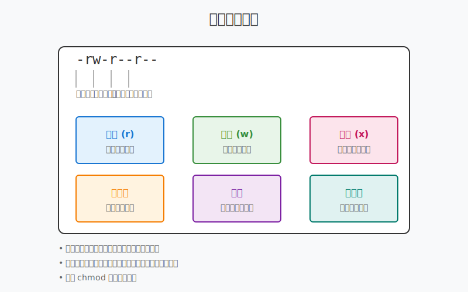

# 1.4 權限和重定向

在 Unix/Linux 系統中，權限控制和輸入輸出重定向是兩個重要的概念。這些功能讓我們能夠安全地管理檔案，並靈活地處理程式的輸入輸出。



## 檔案權限系統

### 權限的基本概念

每個檔案都有三種權限：
- r (read)：讀取
- w (write)：寫入
- x (execute)：執行

這些權限分別應用於三種對象：
- 擁有者 (owner)
- 群組 (group)
- 其他人 (others)

### 查看檔案權限

```bash
ls -l file.txt
# 輸出示例：-rw-r--r--
```

權限字串解析：
```
-rw-r--r--
↓↓↓↓↓↓↓↓↓↓
│└┬┘└┬┘└┬┘
│ │  │  └── 其他人的權限 (r--)
│ │  └───── 群組的權限 (r--)
│ └──────── 擁有者的權限 (rw-)
└────────── 檔案類型 (-：一般檔案，d：目錄)
```

### 修改檔案權限

#### 1. 使用符號模式

```bash
chmod u+x file.txt    # 給擁有者加上執行權限
chmod g-w file.txt    # 移除群組的寫入權限
chmod o=r file.txt    # 設定其他人只能讀取
chmod a+x file.txt    # 給所有人加上執行權限
```

符號說明：
- u：user（擁有者）
- g：group（群組）
- o：others（其他人）
- a：all（所有人）
- +：加入權限
- -：移除權限
- =：設定權限

#### 2. 使用數字模式

```bash
chmod 755 file.txt    # rwxr-xr-x
chmod 644 file.txt    # rw-r--r--
chmod 600 file.txt    # rw-------
```

數字對應：
- 4：讀取 (r)
- 2：寫入 (w)
- 1：執行 (x)

常用權限組合：
| 數字 | 權限 | 常見用途 |
|------|------|----------|
| 755 | rwxr-xr-x | 可執行檔案 |
| 644 | rw-r--r-- | 一般檔案 |
| 600 | rw------- | 私密檔案 |

### 更改檔案擁有者

```bash
chown user:group file.txt    # 更改擁有者和群組
chown user file.txt         # 只更改擁有者
chgrp group file.txt       # 只更改群組
```

## 輸入輸出重定向

### 基本重定向

```bash
# 輸出重定向
echo "Hello" > file.txt     # 覆寫檔案內容
echo "World" >> file.txt    # 追加到檔案末尾

# 輸入重定向
sort < file.txt            # 從檔案讀取輸入
```

### 標準輸出和錯誤輸出

Unix/Linux 系統有三個基本的輸入輸出流：
- 標準輸入 (stdin)：0
- 標準輸出 (stdout)：1
- 標準錯誤 (stderr)：2

```bash
command > output.txt       # 只重定向標準輸出
command 2> error.txt      # 只重定向錯誤輸出
command &> all.txt        # 同時重定向標準輸出和錯誤輸出
```

### 管道 (Pipe)

管道可以將一個命令的輸出作為另一個命令的輸入：

```bash
ls -l | grep ".txt"       # 只顯示 .txt 檔案
cat file.txt | sort       # 排序檔案內容
ps aux | grep "python"    # 查找 python 相關進程
```

## 實用範例

### 1. 設定執行權限並運行腳本

```bash
chmod +x script.sh    # 加入執行權限
./script.sh          # 執行腳本
```

### 2. 保護重要檔案

```bash
chmod 600 config.txt    # 只允許擁有者讀寫
```

### 3. 組合使用管道和重定向

```bash
ls -l | grep ".txt" > text_files.txt    # 將所有 .txt 檔案列表存到檔案
```

## 常見問題

Q：為什麼執行檔案時提示 "Permission denied"？
A：可能缺少執行權限，使用 `chmod +x` 加入執行權限。

Q：什麼時候需要用 sudo？
A：當你需要系統管理員權限時，例如修改系統檔案或安裝軟體。

Q：`>` 和 `>>` 的區別是什麼？
A：`>` 會覆寫檔案內容，`>>` 會追加到檔案末尾。

## 練習建議

1. 權限練習：
```bash
touch test.txt
ls -l test.txt
chmod 644 test.txt
chmod u+x test.txt
```

2. 重定向練習：
```bash
echo "test" > file1.txt
cat file1.txt > file2.txt
ls -l > files.txt
```

3. 管道練習：
```bash
ls -l | wc -l
cat file.txt | sort | uniq
```

## 下一步

- 了解更複雜的權限設定
- 學習更多重定向技巧
- 探索進階的檔案權限管理 