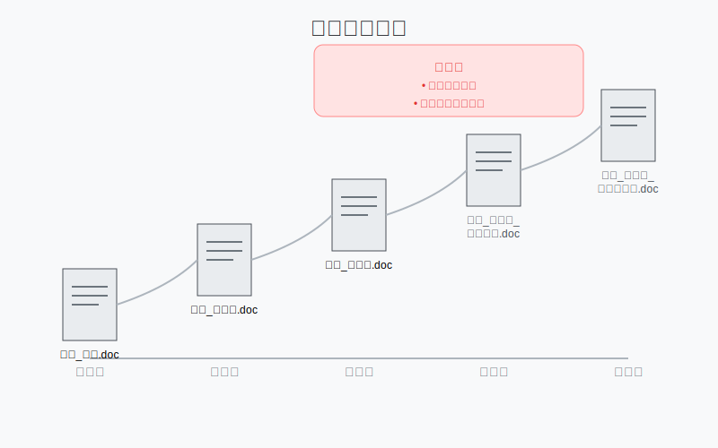
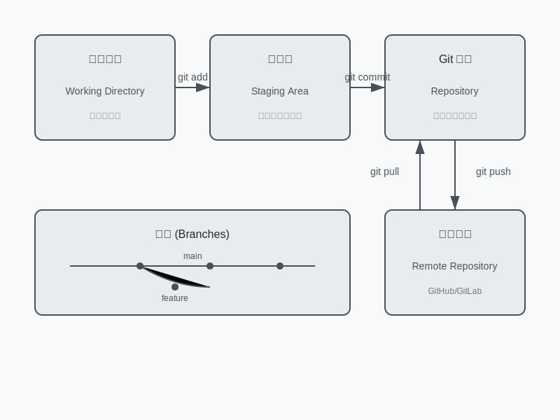

# 2.1 認識版本控制

## 為什麼需要版本控制？

想像一下這個場景：

你正在寫一份重要的報告，隨著修改次數增加，你的資料夾裡出現了這些檔案：
- 報告_初稿.doc
- 報告_修改版.doc
- 報告_最終版.doc
- 報告_最終版_真的最終.doc
- 報告_最終版_這次是真的.doc



這種情況是不是很熟悉？這就是為什麼我們需要版本控制。


版本控制系統（特別是 Git）可以幫你：
- 追蹤所有的修改歷史
- 隨時回到之前的版本
- 清楚知道每次修改了什麼
- 不用擔心檔案會不小心被覆蓋

## Git 是什麼？

Git 是目前世界上最受歡迎的版本控制系統。它就像是一個時光機，可以：
- 記錄專案的完整歷史
- 協助多人同時開發
- 管理不同版本的程式碼

## 重要概念：倉庫（Repository）

倉庫就像是一個專案的容器，包含：
- 所有的程式碼檔案
- 完整的修改歷史
- 專案相關的設定

## 運作流程



想像倉庫就像是一個魔法箱子，裡面不只放著你目前的檔案，還保存著所有檔案的變化歷史。

## 重要概念：提交（Commit）

提交是 Git 中最基本的概念之一。每次提交就像是在專案時間線上打下一個記號，標示：
- 這個時間點檔案的狀態
- 做了哪些修改
- 為什麼要做這些修改

提交就像是遊戲中的存檔點，你隨時可以回到這些點。

## 安裝和設定 Git

### macOS 安裝方式

1. 打開終端機
2. 輸入以下指令：
```bash
git --version
```
如果還沒安裝，系統會提示你安裝。

### 基本設定

安裝完成後，需要設定你的身份：

```bash
git config --global user.name "你的名字"
git config --global user.email "你的信箱"
```

這些資訊會出現在你的提交記錄中，讓其他人知道是誰做的修改。

## 小結

- 版本控制幫助你管理檔案的變化歷史
- Git 是目前最流行的版本控制系統
- 倉庫（Repository）是專案的容器
- 提交（Commit）是記錄變更的方式
- 安裝 Git 很簡單，基本設定也只需要幾個步驟

## 練習題
1. 想想你過去是如何管理檔案版本的？列出這種方式的缺點。
2. 安裝 Git 並完成基本設定。
3. 用 `git --version` 確認安裝是否成功。

## 常見問題
Q: 為什麼要設定 user.name 和 user.email？
A: 這些資訊會記錄在每次的提交中，方便追蹤是誰做了修改。

Q: 可以修改已經設定的 user.name 和 user.email 嗎？
A: 可以，使用相同的指令重新設定即可。

## 下一步
學會這些基本概念後，我們下一章將開始學習如何使用 Git 的基本指令。準備好了嗎？讓我們繼續前進！ 