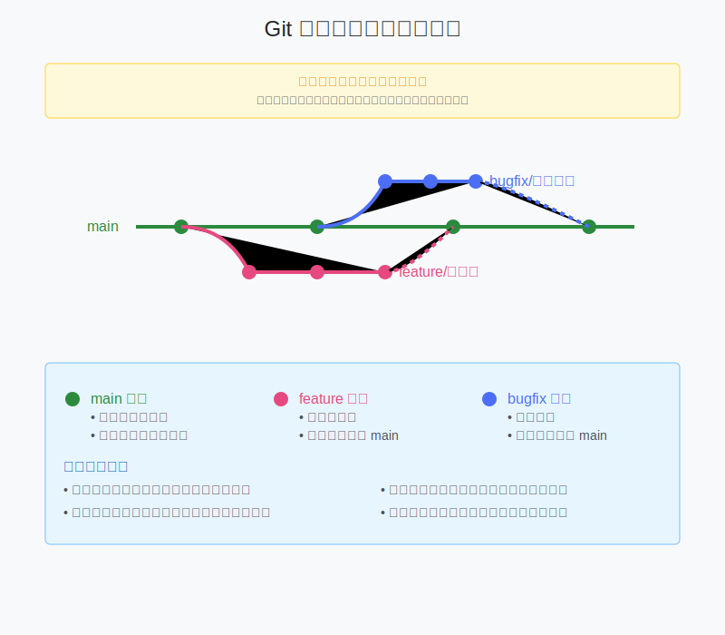

# 2.4 分支操作基礎

## 什麼是分支？

分支（Branch）就像是程式碼的平行宇宙：
- 可以在不影響主要程式碼的情況下開發新功能
- 多人可以同時進行不同的開發工作
- 方便進行測試和實驗



想像你在寫一本書：
- main 分支是正式出版的內容
- 其他分支是你的各種草稿和想法

## 查看分支 (git branch)

查看所有本地分支：
```bash
git branch
```

輸出會像這樣：
```
* main
  feature-login
  bugfix-header
```
星號（*）表示目前所在的分支。

常用的 branch 指令：
- `git branch -a` - 查看所有分支（包含遠端）
- `git branch -v` - 查看分支的最後一次提交
- `git branch -vv` - 查看分支與遠端的追蹤關係

## 建立分支 (git branch)

建立新分支很簡單：
```bash
git branch feature-login
```

建立並切換到新分支（推薦用這個）：
```bash
git checkout -b feature-login
# 或使用更新的語法
git switch -c feature-login
```

## 切換分支 (git checkout/switch)

在分支間切換：
```bash
git checkout feature-login
# 或使用更新的語法
git switch feature-login
```

注意事項：
- 切換前確保目前的修改已經提交或暫存
- 切換會改變工作目錄的檔案內容
- 可以使用 `git stash` 暫存未完成的修改

## 合併分支 (git merge)

當功能開發完成，要將分支的修改合併回主分支：

1. 先切換到目標分支（通常是 main）：
```bash
git checkout main
```

2. 執行合併：
```bash
git merge feature-login
```

合併的類型：
- Fast-forward（快轉）：沒有衝突，直接合併
- Recursive（遞迴）：需要創建新的合併提交
- Conflict（衝突）：需要手動解決衝突

## 解決合併衝突

當兩個分支修改了同一個檔案的同一部分，就會發生衝突：

```
<<<<<<< HEAD
目前分支的內容
=======
要合併的分支的內容
>>>>>>> feature-login
```

解決步驟：
1. 打開有衝突的檔案
2. 找到並修改衝突部分
3. 移除衝突標記（<<<<<<< 等）
4. 儲存檔案
5. 執行 `git add` 和 `git commit`

## 實戰練習：開發新功能

讓我們實際操作一次完整的流程：

1. 建立功能分支：
```bash
git switch -c feature-login
```

2. 開發新功能：
```bash
# 修改檔案
git add .
git commit -m "新增登入功能"
```

3. 合併回主分支：
```bash
git switch main
git merge feature-login
```

## 分支管理最佳實踐

1. 分支命名規則：
   - feature/功能名稱：新功能
   - bugfix/問題描述：修復錯誤
   - hotfix/問題描述：緊急修復
   - release/版本號：發布準備

2. 工作流程建議：
   - 保持 main 分支穩定
   - 一個功能一個分支
   - 定期同步主分支的更新
   - 完成後及時合併或刪除分支

3. 注意事項：
   - 合併前先測試
   - 保持分支簡潔明確
   - 適時清理無用分支

## 常見問題

Q: 如何刪除分支？
A: 使用 `git branch -d 分支名稱`（安全刪除）或 `git branch -D 分支名稱`（強制刪除）

Q: 合併時遇到衝突怎麼辦？
A: 
1. 仔細檢查衝突內容
2. 與團隊溝通確認
3. 選擇正確的內容
4. 完成合併

Q: 如何取消合併？
A: 使用 `git merge --abort`

## 進階技巧

1. 暫存工作進度：
```bash
git stash
git stash pop  # 恢復暫存
```

2. 比較分支差異：
```bash
git diff main..feature-login
```

3. 查看分支合併圖：
```bash
git log --graph --oneline
```

## 下一步

現在你已經學會了分支的基本操作，可以開始在實際專案中運用這些技巧。記住，分支是 Git 最強大的功能之一，多加練習就能得心應手！ 