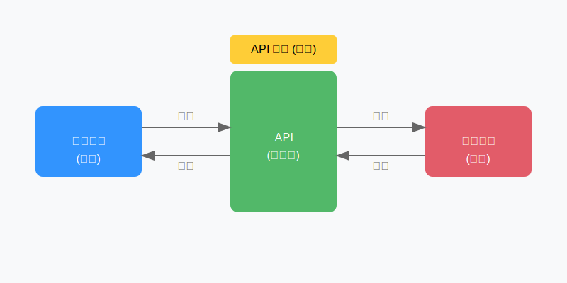
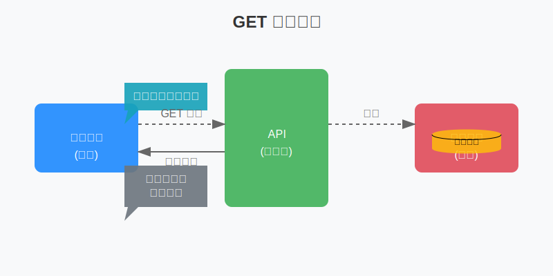
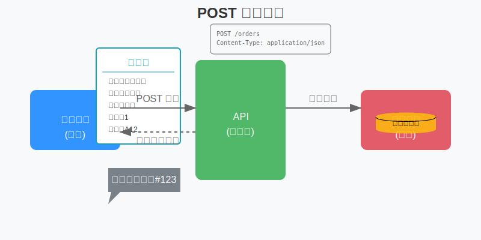

# 4.1 認識 API

## 什麼是 API？


想像你走進一家餐廳：
- 你不需要直接衝進廚房自己煮
- 你只需要看菜單，告訴服務生你要點什麼
- 服務生會把你的需求傳達給廚房
- 一段時間後，服務生會把餐點送到你的桌上




API（應用程式介面）就像是這個服務生：
- 你的程式是顧客
- 其他服務（如 Google、Facebook）是廚房
- API 是服務生，負責傳遞需求和結果
- API 文檔就像是菜單，告訴你可以點什麼、怎麼點

## HTTP 請求方法介紹

### GET：獲取數據



GET 就像是在餐廳：
- 問服務生：「今天有什麼特餐？」
- 看菜單上某道菜的詳細介紹
- 詢問自己的訂單進度

實際例子：
```bash
# 獲取天氣資訊
curl "https://api.weather.com/v1/current?city=taipei"

# 獲取使用者資料
curl "https://api.example.com/users/123"
```

### POST：提交數據



POST 就像是在餐廳：
- 向服務生點餐
- 填寫訂位表格
- 提交特殊餐點要求

實際例子：
```bash
# 創建新用戶
curl -X POST "https://api.example.com/users" \
     -d '{"name": "小明", "email": "ming@example.com"}'

# 提交訂單
curl -X POST "https://api.example.com/orders" \
     -d '{"product": "手機", "quantity": 1}'
```

## JSON 格式介紹

### JSON 語法規則

JSON 就像是一個標準化的點餐單：
- 使用 `{}` 包住整個內容，像是一張完整的表單
- 使用 `""` 包住名稱和文字值
- 使用 `:` 分隔名稱和值
- 使用 `,` 分隔不同項目

基本格式：
```json
{
  "名字": "小明",
  "年齡": 25,
  "是否學生": true,
  "興趣": ["編程", "閱讀", "運動"]
}
```

### 常見 JSON 結構

1. 簡單的鍵值對：
```json
{
  "城市": "台北",
  "溫度": 25,
  "天氣": "晴天"
}
```

2. 包含陣列：
```json
{
  "購物車": [
    {"品項": "筆記本", "價格": 30},
    {"品項": "鉛筆", "價格": 10}
  ]
}
```

3. 巢狀結構：
```json
{
  "用戶": {
    "基本資料": {
      "姓名": "小明",
      "電話": "0912345678"
    },
    "訂單記錄": [
      {"日期": "2024-01-14", "金額": 100}
    ]
  }
}
```

## API 文檔閱讀方法

就像看菜單一樣，API 文檔告訴你：

1. 基本資訊
   - API 的網址（Endpoint）
   - 可用的請求方法（GET/POST等）
   - 需要的認證方式

2. 請求格式
   - 需要提供什麼參數
   - 參數應該放在哪裡（URL、Header、Body）
   - 參數的格式要求

3. 響應格式
   - 會返回什麼數據
   - 數據的結構是什麼
   - 可能的錯誤代碼

例如，一個天氣 API 的文檔可能是這樣：
```
GET /weather/current
描述：獲取指定城市的即時天氣
參數：
  - city: 城市名稱（必填）
  - units: 溫度單位（選填，預設 celsius）
返回：
  {
    "temperature": 25,
    "humidity": 60,
    "description": "晴天"
  }
```

## 實作練習

1. 使用 curl 獲取一個公開 API 的數據：
```bash
# 獲取一個隨機笑話
curl "https://api.example.com/jokes/random"
```

2. 觀察 JSON 響應：
```json
{
  "id": 123,
  "content": "為什麼程序員不能打籃球？因為他們只會調試（Debug）",
  "category": "程序員笑話"
}
```

## 小結

- API 是程式之間溝通的橋樑
- HTTP GET 用於獲取數據，POST 用於提交數據
- JSON 是一種常用的數據交換格式
- 學會閱讀 API 文檔是使用 API 的關鍵

下一章，我們將學習如何使用 curl 工具來實際操作這些 API。 