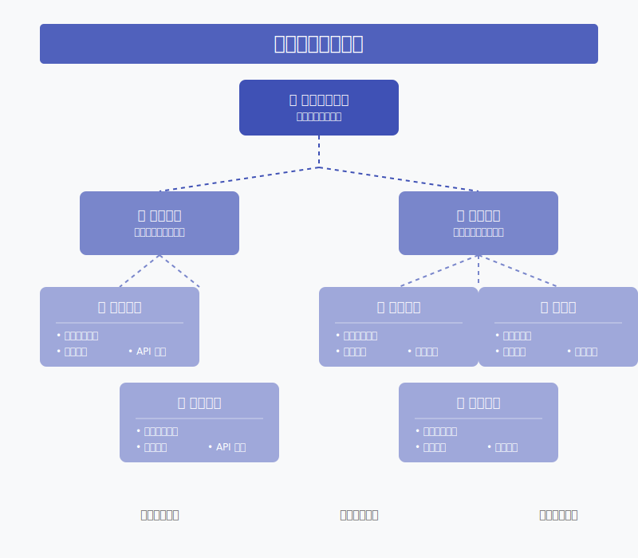

# 任務管理入門

作為新手工程師，最重要的技能之一就是學會管理自己的任務。這章節將教你如何使用簡單的方式來管理中型項目。

## 項目拆解方法

### 自上而下的拆解



從大方向開始，逐步拆解成小任務：

```markdown
# 網站開發項目

## 1. 用戶系統
- [ ] 1.1 登入功能
  - [ ] 1.1.1 登入頁面設計
  - [ ] 1.1.2 表單驗證
  - [ ] 1.1.3 API 串接
- [ ] 1.2 註冊功能
  - [ ] 1.2.1 註冊頁面設計
  - [ ] 1.2.2 資料驗證
  - [ ] 1.2.3 API 串接

## 2. 商品系統
- [ ] 2.1 商品列表
- [ ] 2.2 商品詳情
- [ ] 2.3 購物車
```

### 任務大小原則

一個好的任務大小應該是：
- 可以在 2-4 小時內完成
- 有明確的完成標準
- 可以獨立執行

## 建立個人任務清單

### 1. 基本結構


```markdown
# 任務看板

## 待辦
- [ ] 優先級高：修復登入 bug
- [ ] 優先級中：優化頁面載入速度
- [ ] 優先級低：更新文件

## 進行中
- [ ] 實作購物車功能
  - [x] 新增商品
  - [ ] 修改數量
  - [ ] 刪除商品

## 已完成
- [x] 完成首頁設計
- [x] 實作商品列表
```

### 2. 任務描述格式

每個任務都應該包含：


```markdown
## 任務：實作購物車功能

### 描述
- 功能：讓用戶可以管理購物車內的商品
- 預期結果：用戶可以新增、修改、刪除商品

### 拆解步驟
1. [ ] 新增商品功能
2. [ ] 修改數量功能
3. [ ] 刪除商品功能

### 相關資源
- API 文件：/api/cart
- 設計稿：/design/cart.fig

### 時間估算
- 預計工時：6 小時
- 開始時間：2024-01-20
- 預計完成：2024-01-21
```

## 任務狀態追蹤

### 每日更新格式

```markdown
# 2024-01-20 進度更新

## 購物車功能
- [x] 完成新增商品（2小時）
  - 遇到問題：API 回傳格式不符
  - 解決方案：增加資料轉換層
- [ ] 進行中：修改數量（50%）
  - 卡關點：數量驗證邏輯
  - 下一步：討論驗證規則

## 明日計畫
1. 完成數量修改功能
2. 開始刪除商品功能
```

## 基本任務拆分技巧


### 1. 功能拆分
- 按照使用者操作流程拆分
- 每個步驟都要可以獨立測試
- 考慮錯誤處理和邊界情況

### 2. 技術拆分
```markdown
## 購物車功能技術拆分

1. [ ] 前端介面
   - [ ] HTML 結構
   - [ ] CSS 樣式
   - [ ] 基本互動

2. [ ] 資料處理
   - [ ] 狀態管理
   - [ ] API 串接
   - [ ] 錯誤處理

3. [ ] 功能測試
   - [ ] 單元測試
   - [ ] 整合測試
```

## 設置任務優先級

### 優先級判斷矩陣

使用重要性和緊急性來判斷：

```markdown
## 優先級高（重要且緊急）
- [ ] 修復影響用戶使用的 bug
- [ ] 處理安全性問題
- [ ] 完成關鍵功能開發

## 優先級中（重要不緊急）
- [ ] 程式碼優化
- [ ] 新功能開發
- [ ] 技術文件撰寫

## 優先級低（不重要不緊急）
- [ ] 小型功能優化
- [ ] 非必要功能開發
- [ ] 程式碼重構
```

## 實作建議

1. 保持任務列表更新
   * 每天早上檢視任務列表
   * 及時更新任務狀態
   * 記錄遇到的問題

2. 合理評估時間
   * 給自己緩衝時間
   * 考慮可能的阻礙
   * 不要過度樂觀

3. 靈活調整優先級
   * 根據實際情況調整
   * 及時溝通變更
   * 記錄調整原因

## 常見問題

Q: 如何避免任務列表過於龐大？
A: 使用資料夾或標籤系統分類，只顯示當前週期需要關注的任務。

Q: 任務完成時間總是超出預期怎麼辦？
A: 
1. 記錄實際花費時間，建立時間感
2. 將任務拆得更小
3. 預估時加上 50% 緩衝時間

Q: 如何處理突發任務？
A: 
1. 預留每天 20% 的時間處理突發事件
2. 及時評估影響並調整優先級
3. 必要時溝通調整既定計畫 