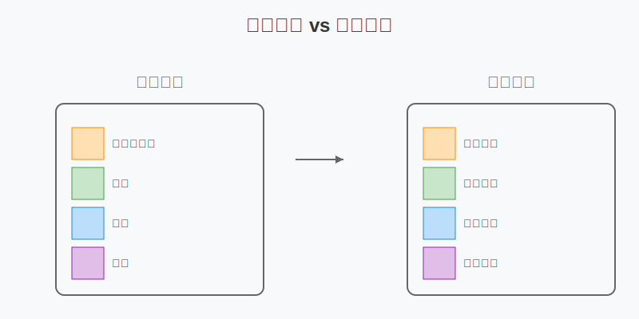
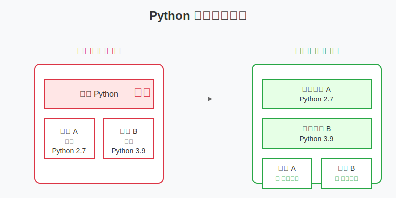
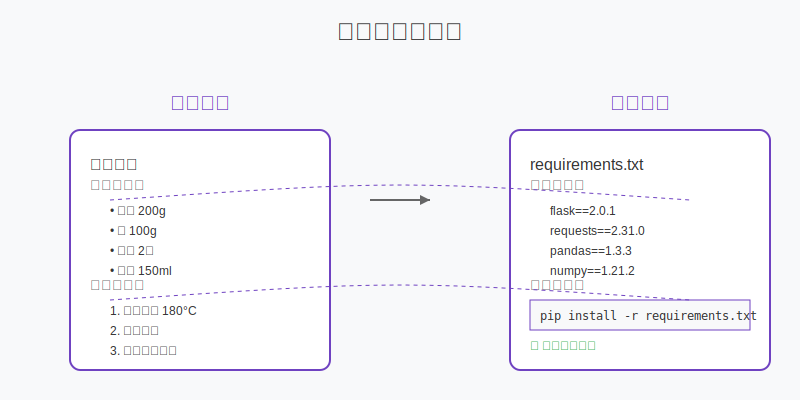
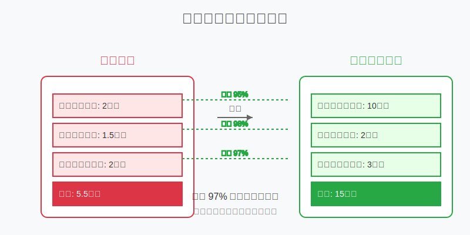

# 認識開發環境

## 什麼是開發環境？

想像一下，你是一位廚師。每次要做菜時，你需要：
- 一個乾淨的廚房（工作空間）
- 合適的廚具（開發工具）
- 新鮮的食材（程式相關套件）
- 食譜和配方（專案相關設定）

程式開發也是一樣的。開發環境就是你寫程式時需要的所有東西的集合：
- 程式語言（例如：Python、JavaScript）
- 開發工具（編輯器、編譯器）
- 相關套件（第三方函式庫）
- 環境設定（設定檔、環境變數）

## 為什麼需要環境管理？

### 1. 避免版本衝突
想像你同時在做兩個專案：
- 專案 A 需要 Python 2.7
- 專案 B 需要 Python 3.9

如果沒有適當的環境管理，這兩個專案可能會互相干擾，導致程式無法正常運作。

### 2. 確保專案可重現性
就像食譜需要詳細記錄所有食材和步驟，好的環境管理可以：
- 記錄所有需要的套件和版本
- 讓其他開發者可以輕鬆重現相同的環境
- 避免「在我電腦上可以運作」的問題

### 3. 提高開發效率
良好的環境管理可以：
- 快速建立新的開發環境
- 方便切換不同專案
- 減少環境問題的困擾

## 基本概念介紹

### 1. 虛擬環境 (Virtual Environment)
- 就像是一個獨立的工作空間
- 可以為每個專案創建專屬的環境
- 不同專案的套件不會互相影響

### 2. 依賴管理 (Dependency Management)
- 管理專案需要的所有外部套件
- 記錄套件的版本資訊
- 方便安裝和更新套件

### 3. 環境變數 (Environment Variables)
- 存放敏感資訊（如 API 金鑰）
- 設定程式運行的參數
- 區分開發/測試/正式環境

## 常見環境問題

### 1. 版本不相容
- 症狀：安裝套件時出現錯誤訊息
- 原因：套件版本衝突
- 解決：使用虛擬環境，明確指定版本號

### 2. 找不到套件
- 症狀：ImportError: No module named 'xxx'
- 原因：套件未安裝或環境路徑設定錯誤
- 解決：確認虛擬環境是否啟動，重新安裝套件

### 3. 環境變數無法讀取
- 症狀：程式無法存取特定設定或金鑰
- 原因：環境變數未正確設定
- 解決：檢查環境變數的設定方式和位置

## 小結

良好的環境管理是開發工作的基礎：
1. 讓開發過程更有條理
2. 避免不必要的問題
3. 提高開發效率
4. 方便團隊協作

下一章，我們會學習如何實際操作虛擬環境。 