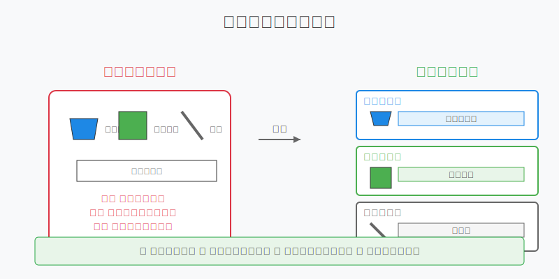

# 虛擬環境入門

## 為什麼需要虛擬環境？

想像你是一位畫家，你有不同的繪畫專案：
- 水彩畫需要水彩顏料和水彩紙
- 油畫需要油畫顏料和畫布
- 素描需要鉛筆和素描本

如果把所有工具都放在一起，不僅容易混亂，還可能會：
- 工具互相污染
- 找不到需要的東西
- 不同專案的工具互相干擾



程式開發也一樣，虛擬環境就像是給每個專案準備的獨立工具箱。

## 虛擬環境基本操作

以 Python 的 `venv` 為例：

### 1. 創建虛擬環境

```bash
# Windows
python -m venv myproject_env

# macOS/Linux
python3 -m venv myproject_env
```

這會創建一個名為 `myproject_env` 的虛擬環境。

### 2. 啟動虛擬環境

```bash
# Windows
myproject_env\Scripts\activate

# macOS/Linux
source myproject_env/bin/activate
```

啟動後，命令列前面會出現 `(myproject_env)`，表示你已經在虛擬環境中。

### 3. 安裝基本依賴

```bash
# 安裝單個套件
pip install requests

# 從 requirements.txt 安裝
pip install -r requirements.txt

# 查看已安裝的套件
pip list
```

### 4. 退出虛擬環境

```bash
deactivate
```

## 環境變數設置

### 什麼是環境變數？

環境變數就像是程式的設定開關，用來：
- 存放敏感資訊（API 金鑰）
- 控制程式行為
- 設定系統路徑

### 如何設置環境變數

#### 1. 臨時設置（當前終端機有效）

```bash
# Windows
set API_KEY=your_api_key

# macOS/Linux
export API_KEY=your_api_key
```

#### 2. 永久設置

##### Windows:
1. 系統設定 → 進階系統設定 → 環境變數
2. 新增或編輯環境變數

##### macOS/Linux:
編輯 `~/.bashrc` 或 `~/.zshrc`：
```bash
export API_KEY=your_api_key
```

### 查看環境變數

```bash
# Windows
echo %API_KEY%

# macOS/Linux
echo $API_KEY
```

## 實用技巧

### 1. 使用 .env 檔案
創建 `.env` 檔案來管理專案的環境變數：
```
API_KEY=your_api_key
DEBUG=True
DATABASE_URL=postgresql://localhost/db
```

### 2. 管理多個虛擬環境
- 為每個專案創建獨立的虛擬環境
- 使用有意義的名稱（例如：project_name_env）
- 保持虛擬環境乾淨，只安裝必要的套件

### 3. 記錄依賴套件
定期更新 `requirements.txt`：
```bash
pip freeze > requirements.txt
```

## 常見問題解答

### 1. 虛擬環境無法啟動
- 檢查 Python 是否正確安裝
- 確認路徑是否正確
- 檢查權限設定

### 2. 套件安裝失敗
- 確認網路連接
- 檢查 pip 是否最新版本
- 查看錯誤訊息中的版本要求

### 3. 環境變數讀取失敗
- 確認變數名稱正確
- 檢查設定的位置和方式
- 重新載入終端機或重啟電腦

## 小結

掌握虛擬環境和環境變數的基本操作，可以：
1. 保持專案環境的獨立性
2. 避免套件版本衝突
3. 方便管理專案設定
4. 提高開發效率

下一章，我們會深入學習依賴管理的技巧。 