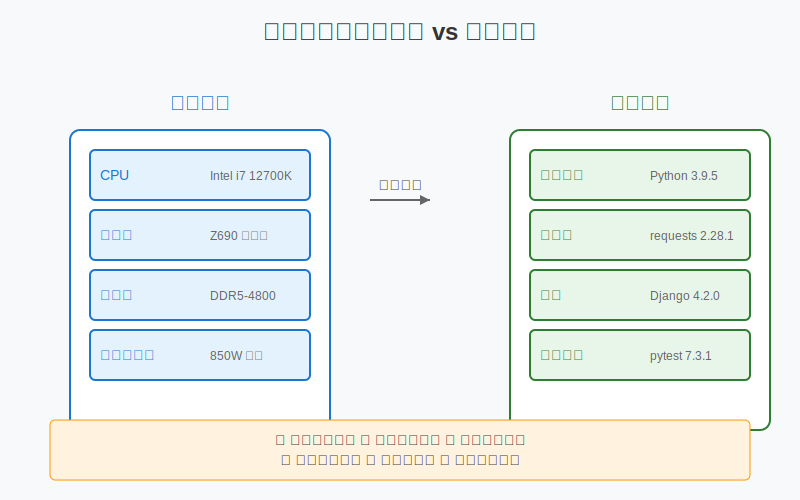

# 依賴管理基礎

## 什麼是依賴管理？

想像你在組裝一台電腦：
- 需要特定型號的 CPU
- 需要相容的主機板
- 需要合適的記憶體
- 需要匹配的電源供應器



程式專案也一樣，需要：
- 特定版本的程式語言
- 相容的函式庫
- 合適的框架
- 匹配的工具套件

依賴管理就是確保這些組件能夠完美配合的過程。

## 包管理工具介紹

不同程式語言有不同的包管理工具：

### Python: pip
```bash
# 安裝套件
pip install requests==2.31.0

# 更新套件
pip install --upgrade requests

# 移除套件
pip uninstall requests
```

### Node.js: npm
```bash
# 安裝套件
npm install axios@1.6.2

# 更新套件
npm update axios

# 移除套件
npm uninstall axios
```

### PHP: Composer
```bash
# 安裝套件
composer require guzzlehttp/guzzle:^7.0

# 更新套件
composer update guzzlehttp/guzzle

# 移除套件
composer remove guzzlehttp/guzzle
```

## 基本依賴管理

### 1. 安裝依賴包

#### 單個安裝
```bash
# Python
pip install requests

# Node.js
npm install express

# PHP
composer require monolog/monolog
```

#### 批量安裝
```bash
# Python
pip install -r requirements.txt

# Node.js
npm install

# PHP
composer install
```

### 2. 查看已安裝的包

```bash
# Python
pip list
pip freeze

# Node.js
npm list
npm list --depth=0

# PHP
composer show
```

### 3. 更新和移除包

#### 更新
```bash
# Python
pip install --upgrade package_name

# Node.js
npm update package_name

# PHP
composer update package_name
```

#### 移除
```bash
# Python
pip uninstall package_name

# Node.js
npm uninstall package_name

# PHP
composer remove package_name
```

## 依賴版本控制

### 1. 版本號格式
使用語意化版本號（Semantic Versioning）：
- 主版本號.次版本號.修訂號（例如：2.1.3）
- 主版本號：不相容的 API 修改
- 次版本號：向下相容的功能性新增
- 修訂號：向下相容的問題修正

### 2. 版本限制語法

#### Python (requirements.txt)
```
requests==2.31.0    # 指定版本
requests>=2.31.0    # 大於等於
requests~=2.31.0    # 約等於（允許修訂號更新）
```

#### Node.js (package.json)
```json
{
  "dependencies": {
    "express": "4.18.2",     // 指定版本
    "axios": "^1.6.2",       // 允許次版本號更新
    "lodash": "~4.17.21"     // 允許修訂號更新
  }
}
```

#### PHP (composer.json)
```json
{
  "require": {
    "monolog/monolog": "2.9.1",      // 指定版本
    "guzzlehttp/guzzle": "^7.0",     // 允許次版本號更新
    "symfony/console": "~6.3.0"      // 允許修訂號更新
  }
}
```

## 常見依賴問題解決

### 1. 版本衝突
- 症狀：安裝失敗，提示版本不相容
- 解決：
  * 檢查依賴關係圖
  * 尋找相容版本
  * 必要時降級或升級相關套件

### 2. 依賴安全漏洞
- 症狀：安全掃描工具發出警告
- 解決：
  * 及時更新到安全版本
  * 定期進行安全性檢查
  * 使用自動化工具監控漏洞

### 3. 依賴過時
- 症狀：套件版本太舊，功能缺失
- 解決：
  * 定期更新依賴
  * 測試更新後的相容性
  * 保持版本追蹤記錄

## 最佳實踐

1. 鎖定版本號
   - 使用精確的版本號
   - 避免使用最新版（latest）
   - 定期更新並測試

2. 依賴文件管理
   - 確保依賴文件版本控制
   - 定期更新依賴清單
   - 註解重要的版本選擇原因

3. 開發流程整合
   - 使用自動化工具檢查更新
   - 實施持續整合測試
   - 建立依賴更新流程

## 小結

良好的依賴管理能夠：
1. 確保專案穩定性
2. 提高開發效率
3. 降低維護成本
4. 增強專案安全性

下一章，我們會學習容器化的基礎知識。 