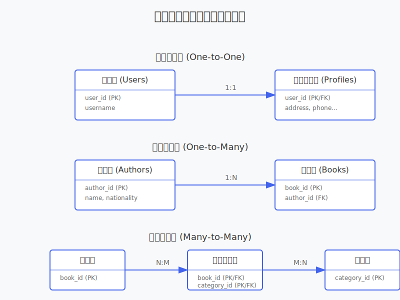
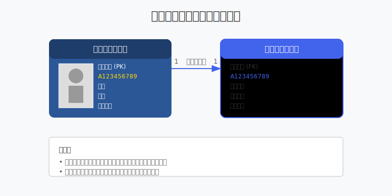
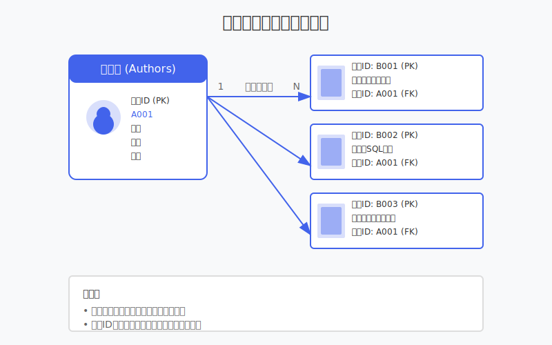
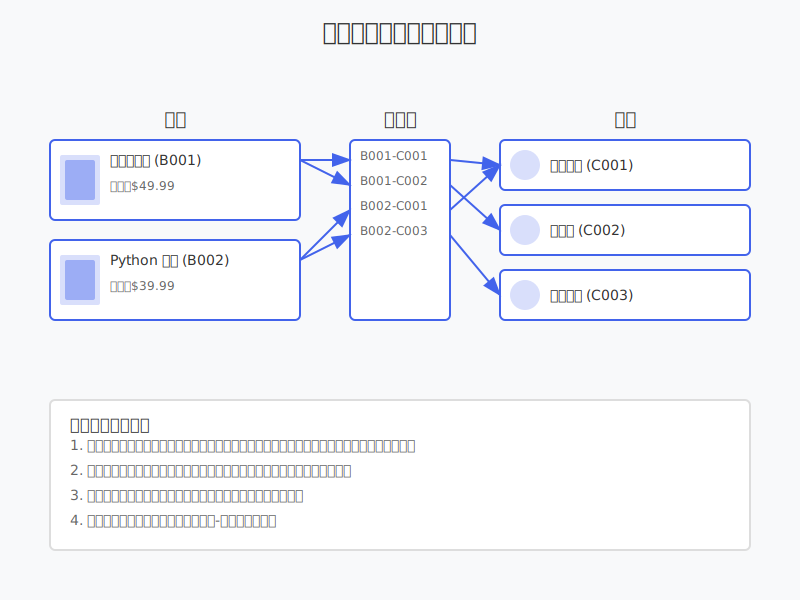
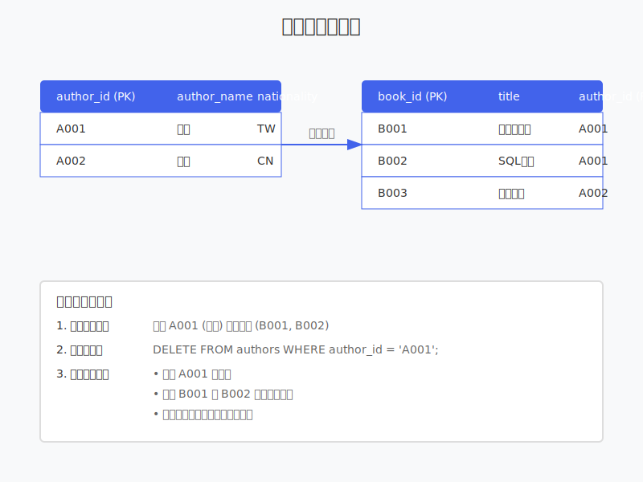

# 7.3 表關係入門

在前面兩章，我們學習了數據庫基礎和 SQL 操作。現在，讓我們來了解表之間的關係，這是設計好的數據庫結構的關鍵。

## 什麼是表關係？

想像你在經營一個網路書店：
* 需要記錄書籍資訊
* 需要記錄顧客資訊
* 需要記錄訂單資訊
* 需要記錄作者資訊

這些資訊不能都放在同一個表格中，需要分開存儲並建立關聯。這就是表關係的用途。



## 關係類型介紹

### 1. 一對一關係（One-to-One）

每個實體只能與另一個實體對應。



例如：用戶和用戶詳細資訊的關係：

```sql
-- 用戶基本資訊表
CREATE TABLE users (
    user_id INT PRIMARY KEY,
    username VARCHAR(50),
    email VARCHAR(100)
);

-- 用戶詳細資訊表
CREATE TABLE user_profiles (
    user_id INT PRIMARY KEY,
    address TEXT,
    phone VARCHAR(20),
    birth_date DATE,
    FOREIGN KEY (user_id) REFERENCES users(user_id)
);
```

### 2. 一對多關係（One-to-Many）

最常見的關係類型，一個實體可以與多個實體對應。



例如：作者和書籍的關係（一個作者可以寫多本書）：

```sql
-- 作者表
CREATE TABLE authors (
    author_id INT PRIMARY KEY,
    author_name VARCHAR(100),
    nationality VARCHAR(50)
);

-- 書籍表
CREATE TABLE books (
    book_id INT PRIMARY KEY,
    title VARCHAR(200),
    author_id INT,
    price DECIMAL(10,2),
    FOREIGN KEY (author_id) REFERENCES authors(author_id)
);
```

### 3. 多對多關係（Many-to-Many）

需要使用中間表（連接表）來實現。

例如：書籍和分類的關係（一本書可以屬於多個分類，一個分類可以包含多本書）：



```sql
-- 書籍表
CREATE TABLE books (
    book_id INT PRIMARY KEY,
    title VARCHAR(200),
    price DECIMAL(10,2)
);

-- 分類表
CREATE TABLE categories (
    category_id INT PRIMARY KEY,
    category_name VARCHAR(50)
);

-- 書籍分類關聯表
CREATE TABLE book_categories (
    book_id INT,
    category_id INT,
    PRIMARY KEY (book_id, category_id),
    FOREIGN KEY (book_id) REFERENCES books(book_id),
    FOREIGN KEY (category_id) REFERENCES categories(category_id)
);
```

## 外鍵的使用



外鍵（Foreign Key）是建立表關係的關鍵：

* 確保數據完整性
* 防止孤立記錄
* 實現級聯操作

例如：當刪除作者時，可以設定對應書籍的處理方式：

```sql
-- 創建帶有級聯刪除的外鍵
CREATE TABLE books (
    book_id INT PRIMARY KEY,
    title VARCHAR(200),
    author_id INT,
    FOREIGN KEY (author_id) 
    REFERENCES authors(author_id)
    ON DELETE CASCADE  -- 當刪除作者時，自動刪除其所有書籍
);
```

## 關聯查詢

### 基本 JOIN 查詢

```sql
-- 查詢書籍及其作者信息
SELECT b.title, a.author_name
FROM books b
JOIN authors a ON b.author_id = a.author_id;

-- 查詢書籍及其所屬分類
SELECT b.title, c.category_name
FROM books b
JOIN book_categories bc ON b.book_id = bc.book_id
JOIN categories c ON bc.category_id = c.category_id;
```

### LEFT JOIN 查詢

包含左表所有記錄：

```sql
-- 查詢所有作者及其著作（包括沒有書的作者）
SELECT a.author_name, b.title
FROM authors a
LEFT JOIN books b ON a.author_id = b.author_id;
```

## 實作練習

1. 創建一個簡單的訂單系統：
   * 顧客表
   * 商品表
   * 訂單表
   * 訂單明細表

2. 練習不同類型的關聯查詢：
   * 查詢顧客的所有訂單
   * 查詢訂單的詳細商品信息
   * 統計每個顧客的消費總額

## 設計建議

1. 正確選擇關係類型：
   * 考慮實際業務場景
   * 評估數據量和查詢需求
   * 注意性能影響

2. 合理使用外鍵：
   * 確保數據完整性
   * 考慮級聯操作的影響
   * 注意性能開銷

3. 避免過度複雜的關係：
   * 保持設計簡單明確
   * 避免過多的表關聯
   * 考慮維護成本

## 小結

* 表關係幫助組織和管理相關數據
* 三種主要關係類型各有用途
* 外鍵確保數據完整性
* 關聯查詢實現數據組合

下一章，我們將學習索引和事務，這些是提升數據庫性能和可靠性的重要工具。 