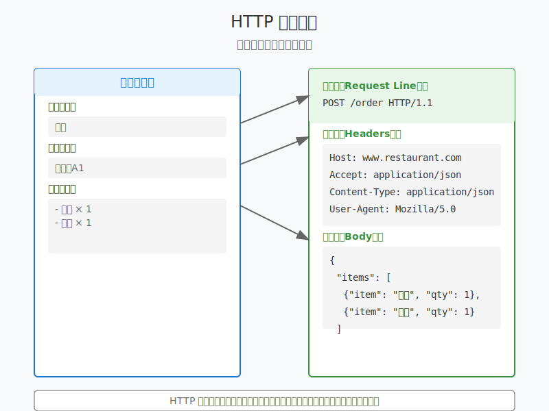

# 8.2 HTTP 通訊基礎

在上一章中，我們用餐廳點餐的例子了解了 HTTP 的基本概念。現在，讓我們更深入地了解 HTTP 請求和響應的具體結構。

## 請求和響應結構

### 請求（Request）結構



就像點餐單一樣，HTTP 請求也有固定的格式：

```http
GET /menu HTTP/1.1
Host: www.restaurant.com
Accept: application/json
User-Agent: Mozilla/5.0
```

1. **請求行**：
   - 方法（GET/POST）
   - 路徑（/menu）
   - HTTP 版本（HTTP/1.1）

2. **請求頭**：
   - `Host`：告訴服務器我們要訪問哪個網站
   - `Accept`：告訴服務器我們想要什麼格式的回應
   - `User-Agent`：告訴服務器我們用什麼瀏覽器

3. **請求體**（POST 請求才有）：
```http
POST /order HTTP/1.1
Host: www.restaurant.com
Content-Type: application/json

{
    "item": "漢堡",
    "quantity": 2
}
```

### 響應（Response）結構

服務器的回應也有固定格式：

```http
HTTP/1.1 200 OK
Content-Type: application/json
Server: nginx

{
    "message": "訂單已接受"
}
```

1. **響應行**：
   - HTTP 版本
   - 狀態碼（200）
   - 狀態描述（OK）

2. **響應頭**：
   - `Content-Type`：告訴瀏覽器內容的格式
   - `Server`：服務器軟件信息

3. **響應體**：
   - 實際的內容（可能是 HTML、JSON 等）

## 常見狀態碼

想像服務生回應你點餐的不同情況：

### 2xx：成功狀態
- **200 OK**：成功（訂單成功送達）
- **201 Created**：創建成功（新訂單已接受）
- **204 No Content**：成功但無返回內容（訂單已取消）

### 4xx：客戶端錯誤
- **400 Bad Request**：請求有誤（點餐內容不清楚）
- **401 Unauthorized**：未認證（沒有會員卡）
- **403 Forbidden**：無權限（不能進入廚房）
- **404 Not Found**：找不到資源（菜品售完了）

### 5xx：服務器錯誤
- **500 Internal Server Error**：服務器錯誤（廚房設備故障）
- **502 Bad Gateway**：網關錯誤（外送系統故障）
- **503 Service Unavailable**：服務不可用（餐廳太忙，暫停接單）

## 常用請求頭介紹

就像點餐時的特殊要求：

```http
Accept: application/json
Content-Type: application/json
Authorization: Bearer eyJhbGc...
Cookie: session=abc123
```

- **Accept**：告訴服務器想要什麼格式的響應
- **Content-Type**：告訴服務器發送的是什麼格式
- **Authorization**：認證信息（會員卡號碼）
- **Cookie**：存儲在瀏覽器的信息（常客優惠）

## 實際觀察

讓我們用開發者工具觀察實際的請求：

1. 打開 Chrome 開發者工具（F12）
2. 切換到 Network 分頁
3. 訪問任何網站
4. 點擊任何請求，觀察：
   - Headers（請求頭/響應頭）
   - Preview（響應預覽）
   - Response（原始響應）

## 實戰練習

1. 使用 curl 發送不同類型的請求：

```bash
# GET 請求
curl -v https://api.example.com/users

# POST 請求帶數據
curl -v -X POST https://api.example.com/users \
  -H "Content-Type: application/json" \
  -d '{"name": "小明"}'
```

2. 觀察響應狀態碼：
```bash
# 測試 404
curl -v https://example.com/not-exist

# 測試 401
curl -v https://api.example.com/protected
```

## 小結

- HTTP 請求和響應都有固定的結構
- 狀態碼告訴我們請求的結果
- 請求頭和響應頭包含重要的元數據
- 實際開發中要善用開發者工具

## 練習題
1. 用開發者工具觀察你的網站登入過程，記錄看到的狀態碼
2. 分析一個 POST 請求的完整結構
3. 找出三個實際網站返回不同狀態碼的例子

## 下一步
理解了 HTTP 通訊的基礎結構後，我們下一章將學習如何進行 HTTP 認證，這對於開發安全的網路應用非常重要。 