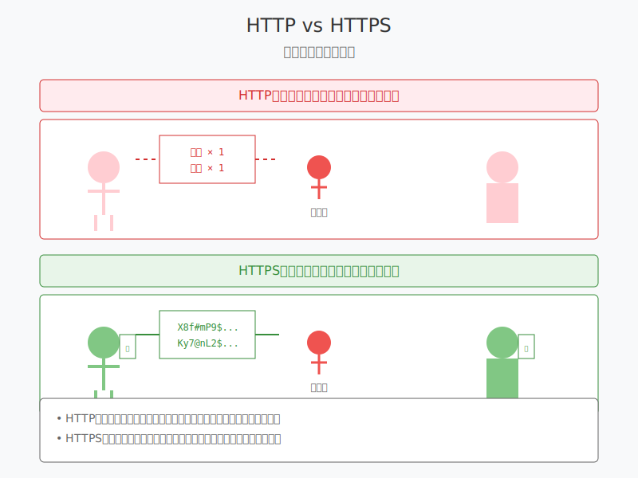
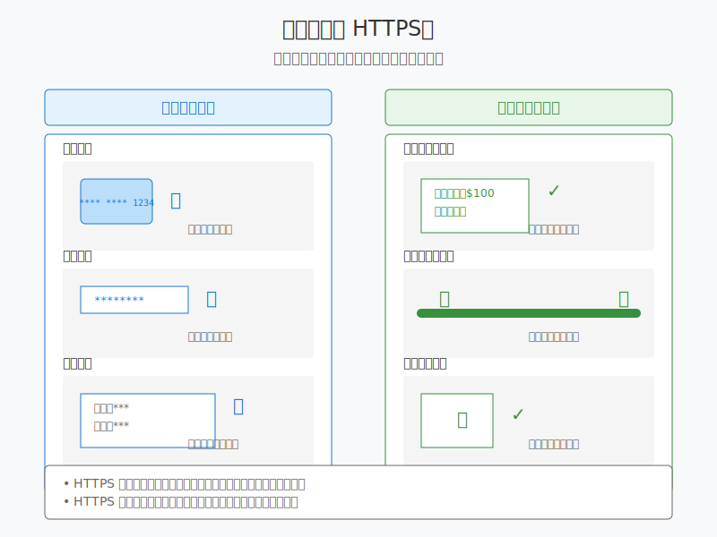

# 8.4 網路安全基礎

在前面的章節中，我們學習了 HTTP 的基本概念和認證機制。現在，讓我們來了解更多關於網路安全的重要知識。

## HTTPS 基礎認識

### 什麼是 HTTPS？



想像你在餐廳點餐：
- HTTP 就像是在大廳裡大聲喊出你的訂單
- HTTPS 則像是用密碼簿寫下訂單，只有服務生才能看懂

HTTPS = HTTP + SSL/TLS（加密層）

### 為什麼需要 HTTPS？



1. 保護數據隱私
   - 防止密碼被偷看
   - 保護信用卡資料
   - 確保個人資料安全

2. 防止數據被篡改
   - 確保收到的是原始數據
   - 防止中間人攻擊

### 如何識別安全連接？

1. 瀏覽器地址欄的標識：
```
🔒 https://www.example.com
```

2. SSL 證書資訊：
   - 點擊鎖頭圖標
   - 查看證書詳情
   - 確認證書有效性

## 基本安全意識培養

### 1. 密碼的安全存儲和傳輸

永遠不要：
```javascript
// ❌ 明文存儲密碼
const password = "mypassword123";

// ❌ 簡單加密
const password = btoa("mypassword123");  // Base64 編碼
```

應該：
```javascript
// ✅ 使用專業的加密函數
const hashedPassword = await bcrypt.hash(password, 10);

// ✅ 使用 HTTPS 傳輸
fetch('https://api.example.com/login', {
    method: 'POST',
    body: JSON.stringify({ password })
});
```

### 2. 個人資料的保護

1. 數據最小化原則：
```javascript
// ❌ 收集過多資料
const userInfo = {
    name: "小明",
    idNumber: "A123456789",  // 不必要的敏感資訊
    creditCard: "1234-5678-9012-3456",  // 不必要的敏感資訊
    address: "台北市..."
};

// ✅ 只收集必要資料
const userInfo = {
    name: "小明",
    email: "user@example.com"
};
```

2. 資料存取控制：
```javascript
// ✅ 設置適當的權限
const userSchema = {
    name: { type: String, public: true },
    email: { type: String, private: true },
    notes: { type: String, role: ['admin', 'owner'] }
};
```

### 3. 常見網路陷阱防範

1. XSS（跨站腳本攻擊）防護：
```javascript
// ❌ 直接插入 HTML
element.innerHTML = userInput;

// ✅ 轉義特殊字符
element.textContent = userInput;
// 或
element.innerHTML = escapeHtml(userInput);
```

2. SQL 注入防護：
```javascript
// ❌ 直接拼接 SQL
const query = `SELECT * FROM users WHERE id = ${userId}`;

// ✅ 使用參數化查詢
const query = `SELECT * FROM users WHERE id = ?`;
db.query(query, [userId]);
```

## API 安全使用準則

### 1. API Key 的正確使用

```javascript
// ❌ 直接在代碼中寫入 API Key
const apiKey = "sk_test_1234567890";

// ✅ 使用環境變量
const apiKey = process.env.API_KEY;

// ✅ 在請求中正確使用
fetch('https://api.service.com/data', {
    headers: {
        'Authorization': `Bearer ${process.env.API_KEY}`
    }
});
```

### 2. 敏感資訊的處理

1. 日誌記錄：
```javascript
// ❌ 記錄敏感信息
console.log(`User ${email} logged in with password ${password}`);

// ✅ 安全的日誌記錄
console.log(`User ${email} logged in successfully`);
logger.info('Login successful', { userId, timestamp });
```

2. 錯誤處理：
```javascript
// ❌ 返回詳細錯誤
catch (err) {
    res.status(500).json({ 
        error: err.stack,
        query: sql,
        params: userInput 
    });
}

// ✅ 返回安全的錯誤信息
catch (err) {
    res.status(500).json({ 
        message: '操作失敗，請稍後再試'
    });
    // 在服務器端記錄詳細錯誤
    logger.error('Database error', err);
}
```

## 開發環境安全配置

### 1. 基本安全檢查清單

- [ ] 使用 HTTPS
- [ ] 設置安全的 HTTP 標頭
- [ ] 實施速率限制
- [ ] 啟用 CSRF 保護
- [ ] 配置安全的 cookie 選項

### 2. 安全標頭配置

```javascript
// Express.js 示例
app.use(helmet());  // 添加安全標頭

// 手動配置
app.use((req, res, next) => {
    res.setHeader('X-Content-Type-Options', 'nosniff');
    res.setHeader('X-Frame-Options', 'DENY');
    res.setHeader('Content-Security-Policy', "default-src 'self'");
    next();
});
```

### 3. 開發環境注意事項

1. 環境變量管理：
```bash
# .env.example（版本控制）
API_KEY=your_api_key_here
DB_PASSWORD=your_db_password_here

# .env（本地開發，不進入版本控制）
API_KEY=actual_api_key
DB_PASSWORD=actual_password
```

2. 依賴包安全：
```bash
# 檢查依賴包安全性
npm audit

# 更新有安全問題的包
npm audit fix
```

## 練習題
1. 檢查一個網站的 HTTPS 配置，分析其安全證書
2. 實現一個簡單的 XSS 防護函數
3. 審查你的項目，找出可能的安全隱患

## 下一步
現在你已經了解了基本的網路安全知識，建議你：
1. 持續關注安全更新
2. 參與安全社群
3. 實踐所學知識到實際項目中 