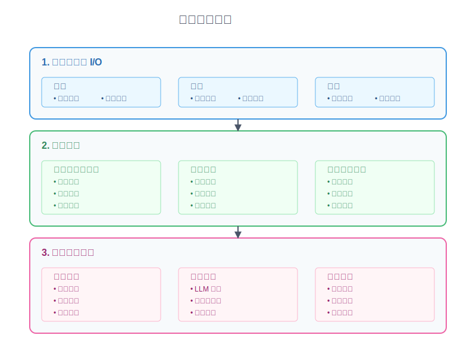
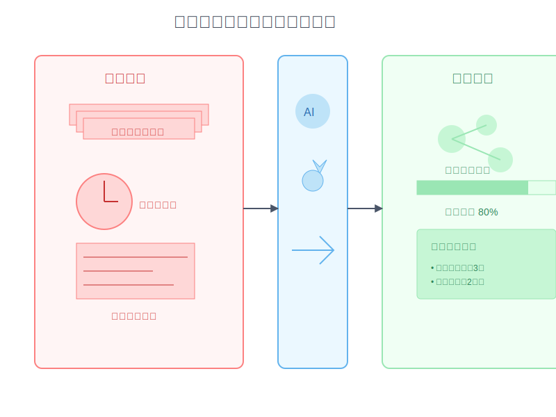

# 9-1 新手的解題思維

想像一下：你剛接到一個新的程式專案，螢幕前的你卻不知從何下手。腦中有一堆想法，但就是無法組織成有效的解決方案。這是不是很熟悉的場景？

你並不孤單。每個工程師都曾經歷過這種時刻 —— 一個看似簡單的需求，卻讓你感覺像是站在迷宮入口，不知該往哪個方向邁出第一步。

## 為什麼需要解題思維？

每個程式設計師的職業生涯，都從"不知道怎麼開始"開始。最常見的困境包括：
1. 面對白板時腦中一片空白
2. 寫出的程式碼雜亂無章，難以維護
3. 遇到 bug 時像迷失在迷宮
4. 解決方案難以在其他專案中重複使用

這些困境不是因為你能力不足，而是缺少一個系統化的思考方法。就像建築師在動工前需要完整的藍圖，程式設計師也需要一個清晰的解題框架。這個框架不只是一個工具，更是你在程式設計路上的指南針，幫助你：

* 將模糊的需求轉化為明確的目標
* 把複雜的問題拆解成可管理的小任務
* 建立可重複使用的解決方案模式
* 在遇到瓶頸時找到突破口

讓我們開始學習這個強大的思維工具。



## 基本解題步驟

想像你是一位偵探，每個程式問題都是一個待解的謎題。優秀的偵探不會直接跳到結論，而是遵循系統化的調查方法。讓我們一起學習這套方法：

### 1. 定義問題的 I/O（輸入/輸出）

這是解題的第一步，也是最關鍵的一步。就像偵探會先確認案件的基本資訊，我們需要清楚地定義：

- 這個問題要達成什麼目標？（確立終點）
- 現在的狀態是什麼？（確認起點）
- 理想的結果是什麼？（設定期望）
- 有什麼限制條件？（了解邊界）

讓我們看一個實際的例子：

假設問題是「內容創作效率低」：
- 輸入：主題選擇、參考資料、寫作時間
- 輸出：文章數量和品質
- 目標：提高產量同時維持品質
- 限制：時間有限、資源受限

這樣的定義幫助我們將抽象的"效率低"問題，轉化為可以具體衡量和改善的指標。

### 2. 拆解問題

大問題就像一座大山，需要一步步切割成可以搬動的小石頭。這個階段分為三個重要步驟：

1. 數字化當前狀態
   - 目前的寫作速度？（例：8小時/篇）
   - 一篇文章的完成時間？（精確到每個環節）
   - 內容品質評分標準？（設定具體指標）

2. 找出瓶頸
   - 選題耗時（2小時在猶豫主題）
   - 資料搜集慢（資料散亂，整理費時）
   - 內容產出慢（缺乏結構化方法）

3. 定義改善目標
   - 目標產出數量（從每週2篇提升到5篇）
   - 品質要求標準（維持90%以上的讀者滿意度）
   - 時間投入上限（每篇文章最多3小時）

### 3. 規劃解決方案

有了清晰的問題定義和具體的目標，現在我們可以設計解決方案。這個階段需要：

1. 分析現狀流程
2. 識別優化機會
3. 設計改進方案

以內容創作為例：
```
[現狀分析]
選題 (2小時) → 寫作 (4小時) → 修改 (2小時) = 8小時/篇

[問題拆解]
1. 選題慢 → 建立主題庫 + LLM 輔助
   - 預先準備100個主題候選
   - 使用 AI 協助主題評估
   - 建立主題評分機制

2. 寫作慢 → 使用模板 + AI 協作
   - 開發3-5個核心文章模板
   - 設置自動化寫作輔助工具
   - 建立快速成文流程

3. 修改慢 → 自動化檢查 + 智能優化
   - 導入自動校對工具
   - 設置品質檢查清單
   - 使用 AI 輔助潤稿

[優化方案]
選題 (0.5小時) → 寫作 (2小時) → 修改 (0.5小時) = 3小時/篇
```

### 4. 逐步實施與驗證

解決方案不是一蹴可幾的，需要循序漸進：

1. 先解決最大瓶頸
   - 建立主題分類系統（第1週）
   - 導入 LLM 輔助選題（第2週）
   - 測試主題效果（第3週）
   - 評估：選題時間是否降到0.5小時以內？

2. 改善主要流程
   - 設計智能寫作模板（第4週）
   - 建立 AI 輔助流程（第5週）
   - 自動化品質檢查（第6週）
   - 評估：總寫作時間是否降到2小時以內？

3. 持續優化調整
   - 每週記錄實施效果
   - 收集具體問題回饋
   - 根據數據調整方案
   - 建立長期改進機制

記住：每個步驟都要有明確的時間表和可衡量的成功指標。這樣不僅能追蹤進展，也能及時調整方向。

## 實戰案例：優化學習流程



### 1. 定義 I/O
- 輸入：學習材料、時間投入、學習方法
- 輸出：知識掌握度、實踐能力
- 目標：提高學習效率，加深理解
- 限制：時間有限、注意力分散

### 2. 問題拆解
1. 學習效率低
   - 資料難以理解
   - 實踐機會少
   - 缺乏即時反饋

2. 知識整合慢
   - 筆記不系統
   - 複習不及時
   - 應用場景少

### 3. 解決方案
```
[學習優化]
1. 輸入優化
   - LLM 輔助理解
   - AI 工具解釋
   - 自動化筆記

2. 處理優化
   - 智能複習提醒
   - 自動化練習
   - 即時反饋系統

3. 輸出優化
   - 知識圖譜建立
   - 自動化測試
   - 應用場景模擬
```

## 常見誤區

1. 直接跳到解決方案
   - 正確做法：先定義問題的 I/O

2. 想一次解決所有問題
   - 正確做法：找出最大瓶頸優先解決

3. 沒有數字化目標
   - 正確做法：設定可量化的改善指標

4. 忽視自動化機會
   - 正確做法：識別可自動化的環節

## 練習建議

1. 分析日常問題
   - 工作流程優化
   - 學習效率提升
   - 時間管理改善

2. 記錄優化過程
   - 問題的 I/O 定義
   - 自動化機會識別
   - 改善效果追蹤

3. 建立解題模板
   - I/O 分析框架
   - 自動化評估表
   - 效果追蹤系統

## 下一步建議

- 練習更多實際案例分析
- 探索 AI 輔助工具應用
- 建立個人自動化流程
- 持續優化解題框架
