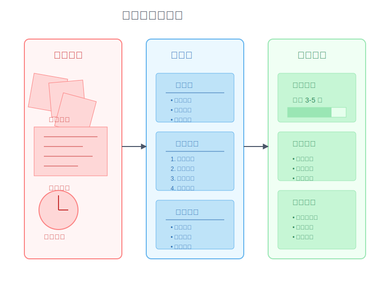

# 9-2 新手常見問題優化：以寫作為例

在開始學習程式設計時，最困擾新手的不只是語法和邏輯，更是「如何有系統地解決問題」這個根本課題。為了更容易理解這個抽象的概念，讓我們用大家都熟悉的寫作來打個比方。

想像你正要寫一篇技術文章。坐在電腦前，腦中有很多想法，卻不知道如何開始，更不知道怎麼把這些想法組織成一篇完整的文章。這種感覺，是不是很像在寫程式時，明明知道要實現什麼功能，卻不知道該如何下手？

## 為什麼要標準化？

標準化思維，是幫助新手跨過程式設計門檻的重要工具。讓我們先用寫作這個例子，來理解標準化是如何幫助我們解決問題的。

當我們深入分析新手在寫作上的痛點，會發現以下幾個核心問題：

1. 起點模糊
   - 不知道從何開始（寫作：選題困難；程式：需求分析不清）
   - 沒有明確方向（寫作：主題發散；程式：功能界定不明）
   - 缺乏系統思維（寫作：結構混亂；程式：架構不清晰）

2. 執行混亂
   - 沒有標準流程（寫作：想到哪寫到哪；程式：想到哪寫到哪）
   - 結構不完整（寫作：邏輯跳躍；程式：模組零散）
   - 品質不穩定（寫作：風格不統一；程式：代碼風格混亂）

3. 效率低下
   - 重複勞動（寫作：反覆修改；程式：重複編碼）
   - 難以複用（寫作：格式不統一；程式：代碼難複用）
   - 維護困難（寫作：結構鬆散；程式：難以維護）

這些問題的根源都指向一個共同點：缺乏標準化的思維框架。透過建立標準化流程，我們可以：
- 建立清晰的思維模式
- 形成可重複的解決方案
- 提高問題解決效率
- 確保輸出品質穩定

接下來，讓我們通過寫作這個例子，來學習如何運用標準化思維解決問題。這些原則同樣適用於程式設計。



## 輸入的標準化：找主題

### 1. 主題來源分類
```
[主題來源清單]
1. 個人經驗
   □ 工作技能與心得
   □ 解決問題的過程
   □ 學習心得與方法
   □ 生活感悟與觀察

2. 專業知識
   □ 技術教學與指南
   □ 工具使用技巧
   □ 產業趨勢分析
   □ AI/LLM 應用研究

3. 回應需求
   □ 讀者提問與回覆
   □ 常見問題整理
   □ 市場痛點分析
   □ 熱門話題討論
```

### 2. 主題評估表
```
[主題評估指標]
重要性評分（30分）：
□ 解決關鍵問題（30分）
□ 改善效率工具（20分）
□ 知識性內容（10分）
□ 一般性話題（5分）

時效性評分（20分）：
□ 當前熱門話題（20分）
□ 近期相關議題（15分）
□ 一般性話題（10分）
□ 過時話題（0分）

可行性評分（50分）：
□ 已有完整經驗（50分）
□ 有部分經驗待補充（30分）
□ 需要研究與整理（20分）
□ 需要 LLM 協助（10分）
```

### 3. 主題庫建立
```
[主題分類矩陣]
            | 立即可寫 | 需要研究 | LLM協助
技術文章    |    3     |    5    |   4
經驗分享    |    5     |    2    |   3
教學指南    |    4     |    3    |   4
AI應用分析  |    2     |    4    |   5

[選題優先順序]
1. 立即可寫 + 技術/經驗
2. LLM協助 + 熱門話題
3. 需要研究 + 讀者需求
```

## 輸出的標準化：內容模板

有了標準化的輸入後，接下來要解決的是如何將這些想法轉化為具體的輸出。在寫作中，這就像是把散亂的想法組織成結構化的文章；在程式設計中，則是將需求轉換為可執行的代碼。

標準化的輸出模板不只是一個格式，更是一種思維框架。它幫助我們：
- 將複雜問題分解為可管理的小單元
- 確保輸出的完整性和一致性
- 提高工作效率和可複製性
- 便於後續的維護和優化

讓我們看看如何通過模板來標準化輸出過程：

### 1. 文章類型定義
```
[內容類型與格式]
1. 技術教學
   - 問題背景說明
   - 解決方案步驟
   - 代碼示例
   - LLM 應用建議
   - 延伸閱讀

2. 經驗分享
   - 情境描述
   - 問題與挑戰
   - 解決過程
   - 自動化方案
   - 建議與提醒

3. 產品評測
   - 產品基本信息
   - 使用場景分析
   - AI 功能評估
   - 自動化潛力
   - 總結建議
```

### 2. 內容結構模板

定義好內容類型後，我們需要一個更細緻的結構模板來組織內容。這就像程式設計中的設計模式（Design Patterns），提供了一個經過驗證的解決方案框架。

好的結構模板應該具備三個特質：
- 邏輯性：確保內容流暢，層次分明
- 完整性：涵蓋所有必要元素，不遺漏重點
- 彈性：能根據實際需求靈活調整

以下是一個通用的結構模板，它同樣適用於撰寫技術文件或程式說明：

```
[標準文章結構]
1. 開頭（吸引注意）
   □ 問題描述
   □ 讀者痛點
   □ 解決承諾
   □ AI 應用場景

2. 主體（內容鋪陳）
   □ 背景說明
   □ 核心觀點
   □ 自動化方案
   □ 實施步驟

3. 結尾（行動呼籲）
   □ 總結重點
   □ 實踐建議
   □ 工具推薦
   □ 互動問題
```

這個結構模板的設計理念，與程式設計中的模組化思維高度一致：
- 開頭就像程式的需求分析和問題定義
- 主體對應於具體的實現方案和步驟
- 結尾則是測試總結和後續優化建議

### 3. 社群發布格式

在完成主要內容後，我們還需要考慮不同發布管道的特性。這就像程式開發中的多平台適配（Cross-platform Development），需要根據不同平台的特性來調整輸出格式。

每個社群平台都有其獨特的：
- 使用者習慣（如 LinkedIn 偏專業，Twitter 偏簡潔）
- 內容限制（如字數限制、格式要求）
- 互動方式（如轉發、評論、分享機制）

以下是針對不同平台的標準化發布模板：

```
[社群貼文模板]
1. LinkedIn
   - 核心觀點（第一段）
   - 自動化經驗（第二段）
   - AI 應用建議（第三段）
   - 互動問題（結尾）

2. Twitter
   - 主要觀點（280字）
   - 自動化技巧（Thread）
   - AI 工具推薦（引用）

3. Facebook
   - 圖片或影片
   - AI 工具說明
   - 延伸閱讀連結
```

這些模板設計的核心理念，與程式開發中的介面適配（Interface Adaptation）相似：在保持核心內容不變的前提下，根據不同平台的特性來調整呈現方式。

## 從結果回推處理流程

### 1. 設定產出目標
```
[每週產出目標]
- 部落格文章：2篇
- LinkedIn貼文：3則
- Twitter討論：5個話題
```

### 2. 時間分配
```
[每篇文章時間預算]
1. 選題與研究：30分鐘
2. 大綱撰寫：30分鐘
3. 內容撰寫：60分鐘
4. 修改潤飾：30分鐘
5. 圖片製作：30分鐘
總計：3小時/篇
```

### 3. 快速寫作流程
```
[文章生產流程]
1. 主題準備
   輸入：主題清單、評估表
   處理：批量評估、排序
   輸出：待寫主題池

2. 內容生產
   輸入：文章模板、參考資料
   處理：套用模板、填充內容
   輸出：文章初稿

3. 優化發布
   輸入：編輯清單、SEO指南
   處理：修改潤飾、格式調整
   輸出：發布版本
```

## 持續優化

### 1. 模板優化方向
```
[優化重點]
1. 開頭段落
   - 更有吸引力的問題拋出
   - 更精準的痛點描述
   - 更明確的價值主張

2. 內容結構
   - 更清晰的層次
   - 更豐富的案例
   - 更實用的操作步驟

3. 互動設計
   - 更有趣的提問
   - 更容易回覆的方式
   - 更多的延伸討論
```

### 2. 效果追蹤
```
[追蹤指標]
1. 數量指標
   - 文章發布頻率
   - 字數達成率
   - 主題完成度

2. 品質指標
   - 閱讀完成率
   - 分享轉發數
   - 讀者回覆數

3. 效率指標
   - 寫作時間
   - 修改次數
   - 套用模板成功率
```

## 實踐建議

1. 建立個人知識庫
   - 收集常用素材
   - 整理參考範例
   - 記錄寫作心得

2. 使用輔助工具
   - 大綱生成工具
   - 寫作模板工具
   - 編輯檢查工具

3. 養成紀錄習慣
   - 靈感收集
   - 問題整理
   - 讀者回饋

## 下一步行動

- 開始建立主題庫
- 設計個人化模板
- 實踐快速寫作流程
- 持續優化與調整
``` 