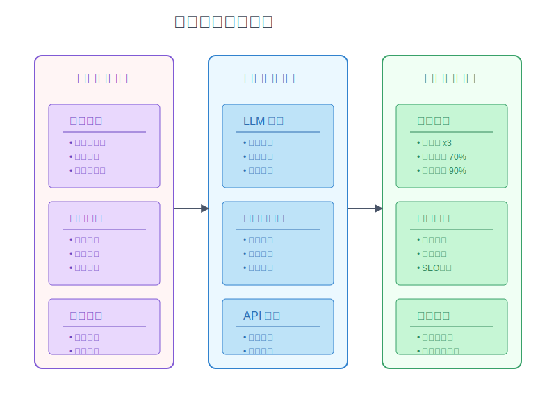

# 9-3 進階新手的自動化思維

你是否發現自己每天都在重複相同的工作？寫程式時總是要複製貼上類似的代碼，或是一遍又一遍地執行相同的操作步驟？這就像一個廚師每天都要切同樣的菜，卻沒想過使用食物處理機一樣。

當我們掌握了標準化的基本功後，就會發現一個有趣的現象：標準化的流程越清晰，就越容易發現其中可以自動化的部分。這就像是在迷霧中找到了一條明確的路徑，接下來要做的就是讓這條路更好走。

## 為什麼需要自動化？

當我們已經完成了基礎的標準化工作：
1. 輸入的標準化（如：主題分類、評估表）
2. 輸出的標準化（如：文章模板、發布格式）

下一個自然的問題就浮現出來了：
- 這些標準化的步驟中，哪些是可以自動化的？
- 如何讓這些重複性的工作變得更快速？
- 怎樣減少人為錯誤，提高整體效率？

這就像是從手工作坊升級到半自動化工廠：不是要完全取代人工，而是讓重複性的工作交給機器，讓我們能專注在更有創造性的任務上。



## 自動化的基本概念

現在我們已經理解了為什麼需要自動化，接下來就要學習如何具體實施。就像是要蓋一棟房子，我們需要先了解地基（可自動化的環節）和建材（自動化的價值），才能開始動工。

自動化不是盲目地把所有事情都交給機器，而是要有策略地選擇和實施。這就像是在廚房裡，我們會選擇用食物處理機處理大量的切菜工作，但最後的調味和擺盤仍需要廚師的專業判斷。讓我們從兩個基本步驟開始：

### 1. 識別可自動化的環節
```
[重複性工作清單]
1. 資料收集
   □ RSS 訂閱整理
   □ 社群話題監控
   □ 競品文章收集
   □ LLM 輔助資料分析

2. 內容產出
   □ LLM 輔助大綱生成
   □ AI 圖片製作
   □ 智能格式排版
   □ SEO 關鍵字優化

3. 發布流程
   □ 跨平台智能發布
   □ 自動標籤生成
   □ 程式化社群分享
   □ 自動化數據追蹤
```

### 2. 評估自動化價值
```
[自動化評估表]
頻率評分（40分）：
□ 每天多次（40分）
□ 每天一次（30分）
□ 每週多次（20分）
□ 偶爾使用（10分）

複雜度評分（30分）：
□ 簡單重複（30分）
□ 固定規則（20分）
□ 部分變化（10分）
□ 高度客製（0分）

效益評分（30分）：
□ 節省大量時間（30分）
□ 減少錯誤（20分）
□ 提高一致性（10分）
□ 略有幫助（5分）
```


## 建立自動化模板


現在我們已經找到了可以自動化的環節，並且評估了它們的價值，接下來就要開始動手了。就像是廚師準備好了食材和工具，下一步就是要把這些元素組合成一個高效的工作流程。

讓我們把這些零散的工作整合成一個個可重複使用的模板。這樣不僅可以提高效率，還能確保每次執行的品質都維持在一定水準之上。

### 1. 資料收集自動化
```
[自動化工具設置]
1. 資訊來源
   輸入：RSS源、社群API、網站爬蟲
   處理：定時抓取、格式轉換
   輸出：結構化資料

2. 分類整理
   輸入：原始資料
   處理：關鍵字分類、標籤添加
   輸出：分類後的資料庫

3. 定期匯總
   輸入：分類數據
   處理：統計分析、報表生成
   輸出：週期性報告
```


### 2. 內容生產自動化


有了自動化的資料收集系統後，我們就像擁有了一個勤奮的助理，持續不斷地為我們收集和整理資訊。但收集到的資料只是原材料，接下來我們需要把這些原材料加工成有價值的內容。

就像一個現代化的廚房，有了食材處理設備後，下一步就是要開始烹飪了。讓我們看看如何運用 AI 工具來協助我們進行內容創作：

```
[自動化模板系統]
1. LLM 大綱生成器
   輸入：主題、關鍵字
   模板：
   - 智能分析目標受眾
   - AI 生成主要論點
   - 自動優化結構
   輸出：結構化大綱

2. 智能內容擴充器
   輸入：大綱要點
   模板：
   - LLM 論點展開
   - AI 案例搜索
   - 自動數據引用
   輸出：初稿內容

3. AI 圖片生成器
   輸入：文章重點
   模板：
   - AI 標題設計
   - 智能視覺化
   - 品牌元素整合
   輸出：配圖套組
```


### 3. 發布流程自動化

內容創作完成後，我們的工作還沒有結束。就像餐廳廚房準備好美食後，還需要專業的服務團隊來確保食物以最佳狀態送到客人面前。同樣地，優質的內容也需要有效的發布策略來確保它能觸及目標讀者。

讓我們來看看如何把發布過程也變得更智能、更有效率：

```
[自動化發布流程]
1. 智能預處理
   □ AI-SEO 檢查
   □ LLM 格式驗證
   □ 自動圖片優化
   □ 智能標籤生成

2. 程式化發布排程
   □ AI 最佳時間預測
   □ 自動平台適配
   □ 智能社群分享
   □ 追蹤連結生成

3. 數據追蹤
   □ 自動化數據收集
   □ AI 互動分析
   □ 智能效果評估
   □ LLM 報告生成
```

到目前為止，我們已經規劃好了完整的自動化藍圖：從資料收集、內容生產到發布流程。就像設計好了一間理想的廚房，知道需要哪些設備和流程。現在，是時候認識具體的工具了。

讓我們來看看市面上有哪些現成的工具可以幫助我們實現這些自動化流程，以及如何組合它們來打造專屬的自動化系統：

## 實作自動化工具

### 1. 基礎工具組合
```
[常用工具清單]
1. 資料收集
   - IFTTT（服務連接）
   - ChatGPT（內容分析）
   - Zapier（工作流程）

2. 內容生產
   - Claude（文章生成）
   - Midjourney（AI圖片）
   - Grammarly（智能校對）

3. 發布管理
   - Buffer（智能排程）
   - Hootsuite（跨平台）
   - Google Analytics（數據分析）
```

### 2. 自動化腳本示例
```python
# RSS 訂閱整理腳本
def collect_rss():
    # 輸入：RSS 來源列表
    sources = load_rss_sources()
    
    # 處理：獲取最新文章
    for source in sources:
        articles = fetch_new_articles(source)
        categorize_articles(articles)
        
    # 輸出：分類整理後的文章列表
    generate_daily_digest()

# 內容模板生成器
def generate_content():
    # 輸入：文章主題和關鍵字
    topic = get_topic()
    keywords = get_keywords()
    
    # 處理：套用模板生成內容
    outline = generate_outline(topic, keywords)
    content = expand_outline(outline)
    
    # 輸出：完整文章初稿
    save_draft(content)
```


## 持續優化流程


有了工具和腳本後，我們的自動化系統就像一台運轉中的機器。但就像任何機器一樣，它需要定期維護和調整才能保持最佳狀態。一個好的自動化系統不是一次性的建置，而是需要持續觀察、學習和改進。

讓我們來看看如何透過系統性的方法來確保我們的自動化流程能夠與時俱進，不斷進化：

### 1. 監控與調整
```
[優化檢查清單]
1. 效率指標
   □ 自動化節省時間
   □ 錯誤發生頻率
   □ 人工干預次數

2. 品質指標
   □ 內容一致性
   □ 格式準確性
   □ 發布及時性

3. 成本指標
   □ 工具使用成本
   □ 維護時間成本
   □ 學習培訓成本
```

### 2. 改進方向
```
[優化方向]
1. 流程優化
   - 簡化步驟
   - 減少等待
   - 增加並行

2. 工具升級
   - 功能擴展
   - 整合度提升
   - 自動化程度

3. 模板改進
   - 更智能的生成
   - 更靈活的調整
   - 更好的適應性
```

知道了要監控什麼，以及往哪個方向改進後，最關鍵的問題來了：如何實際開始這個自動化之旅？就像登山一樣，有了地圖和裝備後，還需要有正確的登山策略才能安全地到達目的地。

讓我們總結一些實用的建議，幫助你在自動化的道路上穩步前進：

## 實踐建議

1. 循序漸進
   - 從最簡單的任務開始
   - 逐步增加自動化程度
   - 持續檢視和調整

2. 保持彈性
   - 預留人工介入的空間
   - 設置異常處理機制
   - 定期審查自動化結果

3. 持續學習
   - 關注新工具和方法
   - 學習基礎程式技能
   - 分享和交流經驗

## 下一步行動

- 列出所有重複性工作
- 評估自動化的優先順序
- 選擇合適的工具開始
- 建立自己的自動化工作流
``` 