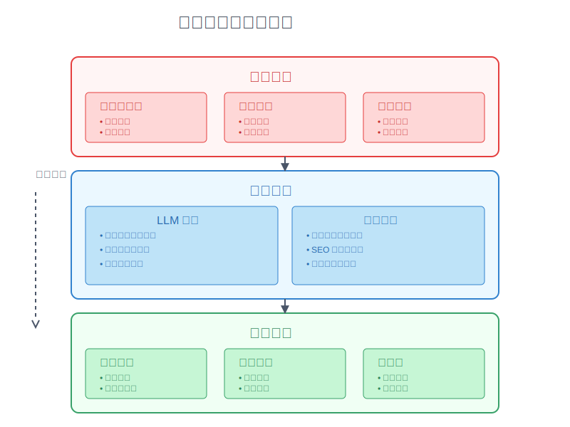
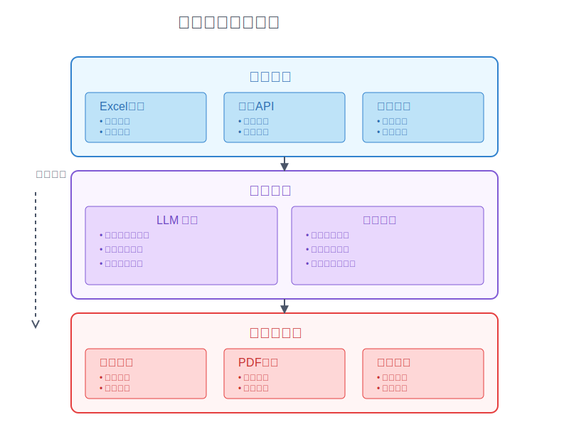

# 9-4 進階新手的系統思考：結合 LLM 與程式

在前一章中，我們學習了如何通過自動化來提升工作效率。但在 AI 時代，僅僅依靠傳統的自動化工具已經不夠了。就像是從手動工具升級到智能機器人，結合 LLM（大型語言模型）與程式設計，能讓我們的自動化系統更聰明、更靈活。

這就像是讓一個經驗豐富的助手加入你的工作團隊：LLM 負責理解複雜的情境和做出智慧判斷，而程式則確保這些判斷能夠準確且高效地執行。讓我們看看如何把這兩種力量結合起來：

## LLM 與程式的智能整合


要建立一個智能化的系統，第一步就是要解決輸入的問題。在現實世界中，我們面對的資料往往是非結構化的：手寫筆記、語音記錄、掃描文件...這些都不是電腦能直接處理的格式。

這就像是要整理一個雜亂的倉庫，在開始分類存放之前，我們需要先把所有物品整理成可以辨識和處理的狀態。LLM 在這個階段扮演著「智能助理」的角色，幫助我們理解和轉換各種形式的輸入。

## 輸入標準化：LLM 處理

### 1. 非結構化輸入處理
```
[輸入類型與處理方式]
1. 紙本文件
   輸入：掃描 OCR
   LLM：版面分析、文字識別
   輸出：結構化數據

2. Excel 表格
   輸入：原始表格
   LLM：格式識別、數據清理
   輸出：標準化數據

3. 處方箋/表單
   輸入：圖片或PDF
   LLM：關鍵信息提取
   輸出：標準格式數據

4. 電話記錄
   輸入：語音轉文字
   LLM：內容理解、重點提取
   輸出：結構化記錄
```

### 2. LLM 提示詞模板
```
[提示詞框架]
1. 處方籤分析
   系統提示：你是一位專業的藥劑師助手
   任務描述：請從以下OCR處方籤文字中提取關鍵醫療信息
   輸出格式：JSON格式，包含以下字段：
     - 病患資訊（姓名、年齡、病歷號）
     - 開立日期
     - 藥品清單（藥名、劑量、用法、天數）
     - 醫師資訊
   特殊要求：確保藥品名稱與劑量的準確性

2. 會議記錄整理
   系統提示：你是一位專業的會議記錄整理專家
   任務描述：請將以下會議逐字稿轉換為結構化的會議記錄
   輸出格式：JSON格式，包含：
     - 會議基本信息（時間、地點、參與者）
     - 討論主題清單
     - 重要決議事項
     - 待辦事項（負責人、期限）
   特殊要求：保留重要討論內容，省略閒聊內容

3. 筆記報告轉換
   系統提示：你是一位專業的報告撰寫專家
   任務描述：請將以下雜亂筆記轉換為結構化報告
   輸出格式：JSON格式，包含：
     - 報告主題
     - 執行摘要
     - 主要發現
     - 建議事項
     - 後續行動
   特殊要求：整理邏輯架構，突出重點內容
```


## 處理流程：LLM + 程式結合

有了標準化的輸入和明確的提示詞框架後，下一步就是要把 LLM 的智慧和程式的效率結合起來。這就像是讓一個聰明的分析師和一個精準的執行者合作：LLM 負責理解和判斷，程式負責執行和驗證。

讓我們來看看如何設計這個智能與效率的完美配合：


### 1. 智能處理流程
```python
# 結合 LLM 的處理流程
class SmartProcessor:
    def __init__(self):
        self.llm = initialize_llm()
        self.tools = load_processing_tools()

    def process_input(self, input_data, input_type):
        # LLM 理解輸入
        structured_data = self.llm.analyze(
            input_data,
            input_type
        )
        
        # 程式處理數據
        processed_data = self.process_data(
            structured_data
        )
        
        # LLM 生成回應
        response = self.llm.generate_response(
            processed_data
        )
        
        return response

    def process_data(self, data):
        # 具體的數據處理邏輯
        result = self.tools.process(data)
        return result
```

### 2. 混合處理模式


```
[處理流程設計]
1. 數據理解
   LLM：理解上下文、識別意圖
   程式：數據驗證、格式轉換
   
2. 邏輯處理
   LLM：複雜判斷、例外處理
   程式：規則執行、數據計算

3. 結果生成
   LLM：生成自然語言描述
   程式：格式化輸出、數據存儲
```

## 智能化應用場景：LLM + API + Template 整合

```
[整合效果展示]
1. 客戶通知優化
   - LLM：分析客戶狀態，選擇溝通語氣
   - API：串接客戶資料，即時更新狀態
   - Template：根據情境動態調整內容

2. 報告生成增強
   - LLM：解讀數據意義，提供見解
   - API：自動收集多源數據
   - Template：智能排版與重點標示

3. 異常處理回應
   - LLM：判斷異常嚴重程度
   - API：觸發對應處理流程
   - Template：產生分層級的通知內容
```

## 實際應用案例

### 1. 文章創作自動化



```
[創作流程]
1. 輸入處理
   - 主題關鍵字分析
   - 參考資料整理
   - 大綱需求提取

2. 智能處理
   LLM：
   - 內容規劃
   - 風格調整
   - 文章生成
   
   程式：
   - 資料庫查詢
   - SEO 優化
   - 版本控制

3. 內容輸出
   - 網頁發布
   - 社群平台分享
   - 電子報排版
```

### 2. 數據分析報告



```
[報告生成流程]
1. 數據收集
   - Excel報表匯入
   - 系統數據API
   - 人工輸入表單

2. 智能分析
   LLM：
   - 趨勢分析
   - 異常識別
   - 建議生成
   
   程式：
   - 數據計算
   - 圖表生成
   - 報表格式化

3. 多形式輸出
   - 圖表展示
   - PDF報告
   - 郵件摘要
```

透過這些實際應用案例，我們可以看到 LLM 和程式結合的強大潛力。但就像任何系統一樣，實際運行中總會遇到各種挑戰：輸入格式的多樣性、處理效率的瓶頸、輸出品質的穩定性等。

要讓系統更加完善，我們需要在實踐中不斷優化。就像是調校一台精密儀器，每個環節都需要細心調整：

## 優化建議

1. 輸入優化
   - 標準化模板設計
   - 多格式支援
   - 錯誤處理機制

2. 處理優化
   - LLM 提示詞優化
   - 程式效能提升
   - 異常處理完善

3. 輸出優化
   - 格式多樣化
   - 自動化程度提升
   - 反饋機制建立

## 下一步行動

- 評估現有流程中可優化項目
- 選擇合適的 LLM 模型
- 建立基礎程式框架
- 進行小規模測試與優化
``` 